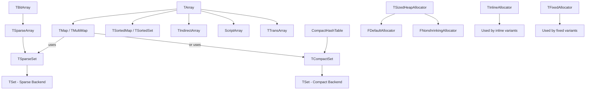
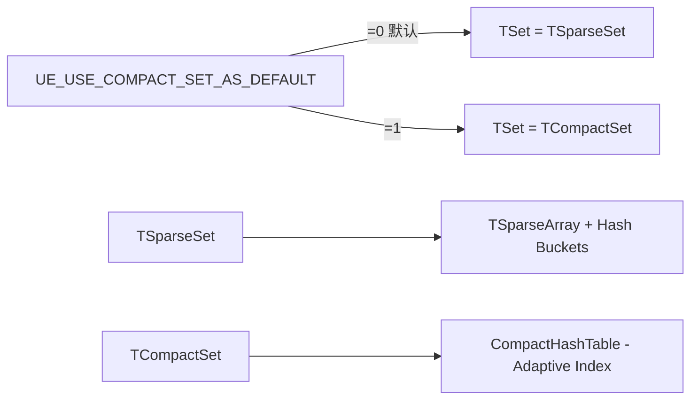
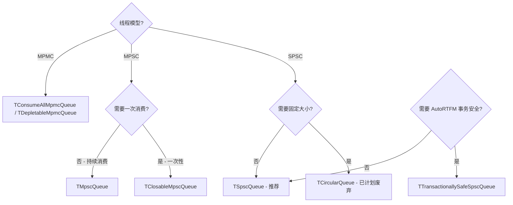
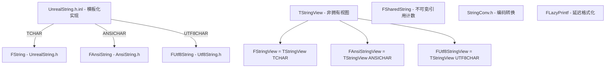

# Unreal Engine Containers 目录类分析

> **路径**: `Engine/Source/Runtime/Core/Public/Containers/`
>
> 本文档对 UE 容器库中每个头文件及其包含的类/结构体/工具进行了详细分析。

---

## 目录

- [1. 动态数组 (Dynamic Arrays)](#1-动态数组-dynamic-arrays)
- [2. 固定/静态数组 (Fixed/Static Arrays)](#2-固定静态数组-fixedstatic-arrays)
- [3. 视图类 (Views)](#3-视图类-views)
- [4. 位数组 (Bit Arrays)](#4-位数组-bit-arrays)
- [5. 集合 (Sets)](#5-集合-sets)
- [6. 映射表 (Maps)](#6-映射表-maps)
- [7. 哈希表 (Hash Tables)](#7-哈希表-hash-tables)
- [8. 链表 (Linked Lists)](#8-链表-linked-lists)
- [9. 队列 (Queues)](#9-队列-queues)
- [10. 并发数据结构 (Concurrent Data Structures)](#10-并发数据结构-concurrent-data-structures)
- [11. 缓冲区 (Buffers)](#11-缓冲区-buffers)
- [12. 字符串 (Strings)](#12-字符串-strings)
- [13. 分配器策略 (Allocator Policies)](#13-分配器策略-allocator-policies)
- [14. 树与路径 (Trees and Paths)](#14-树与路径-trees-and-paths)
- [15. 缓存 (Caches)](#15-缓存-caches)
- [16. 定时器 (Tickers)](#16-定时器-tickers)
- [17. 迭代器与适配器 (Iterators and Adapters)](#17-迭代器与适配器-iterators-and-adapters)
- [18. 辅助工具与类型特征 (Utilities and Traits)](#18-辅助工具与类型特征-utilities-and-traits)
- [19. 前向声明与包含文件 (Forward Declarations and Include Files)](#19-前向声明与包含文件-forward-declarations-and-include-files)
- [20. 架构总览](#20-架构总览)

---

## 1. 动态数组 (Dynamic Arrays)

### `Array.h`
**核心文件**，约 4166 行，定义了 UE 中最基础的容器。

| 类名 | 作用 |
|------|------|
| `TArray<InElementType, InAllocatorType>` | UE 的核心动态数组，类似 `std::vector`。支持排序、堆操作、序列化、批量序列化、Slack 跟踪、内存镜像冻结 (Freeze Memory Image)。默认使用 `FDefaultAllocator` (32 位索引)。 |
| `TIndexedContainerIterator<ContainerType, ElementType, IndexType>` | 基于索引的通用容器迭代器，用于 TArray 和 TIndirectArray。 |
| `TCheckedPointerIterator<T>` | 调试用迭代器，在迭代过程中检测容器是否发生了 resize，防止悬空指针。 |
| `TDereferencingIterator<ElementType, IteratorType>` | 迭代器包装器，自动解引用指针元素，用于 `TIndirectArray` 的范围 for 循环。 |
| `TCanBulkSerialize<T>` | 类型特征，标记可以进行批量序列化的类型（算术类型）。 |

### `ArrayBuilder.h`
| 类名 | 作用 |
|------|------|
| `TArrayBuilder<ElementType, Allocator>` | 用流式 API 构建 `TArray` 的 Builder 模式。提供 `Add()`、`AddUnique()`、`Append()` 链式方法，最后调用 `Build()` 生成数组。 |

### `BasicArray.h`
| 类名 | 作用 |
|------|------|
| `TBasicArray<T>` | 极简的 RAII 动态数组，没有 TArray 的重量级依赖。不可复制，仅可移动。内部使用 `FData` 头结构存储 Num/Max。适合在底层模块中使用（避免循环依赖）。 |

### `ChunkedArray.h`
| 类名 | 作用 |
|------|------|
| `TChunkedArray<InElementType, TargetBytesPerChunk, AllocatorType>` | 分块数组，使用多个小块分配代替单一大块，避免内存碎片。默认每块 16KB。支持 `CopyToLinearArray()` / `MoveToLinearArray()` 转换为连续数组。 |

### `IndirectArray.h`
| 类名 | 作用 |
|------|------|
| `TIndirectArray<T, Allocator>` | 间接数组，内部存储元素指针。调整索引数组大小时不需要重新定位实际元素。拥有并管理所指向对象的生命周期（析构时 delete）。支持序列化。 |

### `PagedArray.h`
| 类名 | 作用 |
|------|------|
| `TPagedArray<T, PageSize>` | 分页数组，以固定大小页面为单位分配。元素在页面内连续存储，但不同页面之间不连续。适合需要稳定元素地址的场景。 |

### `TransArray.h`
| 类名 | 作用 |
|------|------|
| `TTransArray<T>` | 事务性数组，在修改时通过 `UObject` 事务系统记录 undo/redo 操作。用于编辑器撤销系统。 |

### `ScriptArray.h`
| 类名 | 作用 |
|------|------|
| `FScriptArray` | 无类型的动态数组，镜像 TArray 的内存布局，供 Blueprint/脚本系统使用。操作以原始字节为单位（不知道元素类型）。 |

### `ResourceArray.h`
| 类名 | 作用 |
|------|------|
| `FResourceArrayInterface` | 资源数组接口，定义了 CPU 和 GPU 都可访问的资源数组抽象。用于渲染资源（顶点缓冲、索引缓冲等）。 |

### `DynamicRHIResourceArray.h`
| 类名 | 作用 |
|------|------|
| `TDynamicRHIResourceArray<T>` | 实现了 `FResourceArrayInterface` 的动态数组，允许将 TArray 数据直接传递给 RHI 层（渲染硬件接口）。 |

### `MRUArray.h`
| 类名 | 作用 |
|------|------|
| `TMRUArray<T>` | 最近使用 (Most Recently Used) 数组。维护固定大小的数组，新元素添加到前端，溢出时从尾部移除。 |

---

## 2. 固定/静态数组 (Fixed/Static Arrays)

### `StaticArray.h`
| 类名 | 作用 |
|------|------|
| `TStaticArray<T, N, Alignment>` | 固定大小数组，类似 `std::array<T, N>`。编译期确定大小，支持序列化和 `operator[]` 访问。可指定对齐方式。 |

### `Deque.h`
| 类名 | 作用 |
|------|------|
| `TDeque<T>` | 双端队列（Sequential），支持 `EmplaceBack()` / `EmplaceFront()` / `PopBack()` / `PopFront()`。两端 O(1) 插入/删除。 |

---

## 3. 视图类 (Views)

### `ArrayView.h`
| 类名 | 作用 |
|------|------|
| `TArrayView<InElementType, InSizeType>` | 非拥有的连续数组视图，类似 `std::span`。支持 `Left()` / `Right()` / `Mid()` / `Slice()` 子视图操作。可从 TArray、C 数组、`std::initializer_list` 等构造。 |

### `StridedView.h`
| 类名 | 作用 |
|------|------|
| `TStridedView<T>` | 跨步视图，访问非连续内存中的元素，通过可配置的字节步长 (stride) 在内存中跳跃。适合访问结构体数组中的特定字段。 |

---

## 4. 位数组 (Bit Arrays)

### `BitArray.h`
**约 2092 行**，定义了动态位数组及相关工具。

| 类名 | 作用 |
|------|------|
| `TBitArray<Allocator>` | 动态大小位数组。支持按位 AND/OR/XOR/NOT 运算，`CountSetBits()`，范围操作，`Find()` / `FindLast()` / `FindFrom()` 查找，`Insert()` / `Remove()`。以 DWORD (32 位) 为单位存储。 |
| `FBitReference` | 可写位引用代理，通过 DWORD 指针 + 掩码实现单个 bit 的读写。 |
| `FConstBitReference` | 只读位引用代理。 |
| `FRelativeBitReference` | 通过字 (Word) 索引和掩码引用一个 bit。是迭代器的基类。 |
| `FBitArrayMemory` | 提供 `MemmoveBitsWordOrder()` 等 bit 级别的内存操作工具。 |
| `FBitSet` | 工具类，提供 `GetAndClearNextBit()`（原子获取并清除下一个设置位）和 `CalculateNumWords()`。 |
| `TConstSetBitIterator<Allocator>` | 只迭代已设置（为 true）的 bit 的迭代器。跳过全零的 DWORD 提高效率。 |
| `TConstDualSetBitIterator<Allocator, Allocator>` | 同时迭代两个位数组中都已设置的 bit。 |
| `EBitwiseOperatorFlags` | 枚举标志（`MaxSize` / `MinSize` / `MaintainSize` / `OneFillMissingBits`），控制按位运算时数组大小的处理策略。 |

### `StaticBitArray.h`
| 类名 | 作用 |
|------|------|
| `TStaticBitArray<NumBits>` | 编译期固定大小的位数组。在栈上分配，操作更高效。支持按位运算和 `operator[]`。 |

---

## 5. 集合 (Sets)

UE 提供三种 Set 实现，通过 `UE_USE_COMPACT_SET_AS_DEFAULT` 宏切换默认实现。

### `Set.h`
| 类名 | 作用 |
|------|------|
| `TSet<ElementType, KeyFuncs, Allocator>` | UE 的哈希集合（默认可使用 Sparse 或 Compact 实现）。当使用 Sparse 实现时，基于 `TSparseArray` + 哈希桶链表。支持 `Add()` / `Remove()` / `Contains()` / `Find()`，均为 O(1) 平均复杂度。支持 `Intersect()` / `Union()` / `Difference()`。 |

### `SparseSet.h`
| 类名 | 作用 |
|------|------|
| `TSparseSet<ElementType, KeyFuncs, Allocator>` | 基于稀疏数组的哈希集合实现。使用 `TSparseArray` 存储元素，`TArray` 存储哈希桶链表。这是传统的 `TSet` 后端实现。 |

### `SparseSetElement.h`
| 类名 | 作用 |
|------|------|
| `TSetElement<InElementType>` | Sparse Set 中存储的元素包装器，额外存储 `HashNextId`（哈希链表的下一个元素索引）和 `HashIndex`（元素所在的哈希桶索引）。 |

### `CompactSet.h` / `CompactSet.h.inl`
| 类名 | 作用 |
|------|------|
| `TCompactSet<ElementType, KeyFuncs, Allocator>` | 基于 Compact Hash Table 的集合实现。使用自适应索引类型（uint8/uint16/uint32），内存更紧凑。适合小型集合。 |

### `CompactSetBase.h`
| 类名 | 作用 |
|------|------|
| `TCompactSetBase<...>` | `TCompactSet` 的基类模板，实现了集合的核心逻辑（添加/删除/查找/迭代/Rehash）。 |

### `ScriptCompactSet.h`
| 类名 | 作用 |
|------|------|
| `FScriptCompactSet` | 无类型的 Compact Set，供 Blueprint/脚本系统使用。镜像 `TCompactSet` 的内存布局。 |

### `ScriptSparseSet.h`
| 类名 | 作用 |
|------|------|
| `FScriptSparseSet` | 无类型的 Sparse Set，供 Blueprint/脚本系统使用。镜像 `TSparseSet` 的内存布局。 |

### `SortedSet.h`
| 类名 | 作用 |
|------|------|
| `TSortedSet<ElementType, ArrayType>` | 有序集合，基于排序的 `TArray` 实现。O(Log n) 查找，O(n) 添加/删除。适合需要有序遍历的场景。 |

### `SetUtilities.h`
| 类名 | 作用 |
|------|------|
| `TIsTSet<T>` | 类型特征，判断类型 T 是否为 `TSet`。 |

---

## 6. 映射表 (Maps)

### `Map.h` / `Map.h.inl`
| 类名 | 作用 |
|------|------|
| `TMap<KeyType, ValueType, SetAllocator, KeyFuncs>` | UE 的哈希映射表，基于 `TSet<TPair<KeyType, ValueType>>` 实现。O(1) 平均查找/插入/删除。支持 `FindOrAdd()`、`FindRef()`、`GenerateKeyArray()` / `GenerateValueArray()`。 |
| `TMultiMap<KeyType, ValueType, SetAllocator, KeyFuncs>` | 允许同一 Key 对应多个 Value 的哈希映射表。继承自 `TMap`，重写键比较逻辑。 |
| `TPair<KeyType, ValueType>` | 键值对结构体，作为 TMap/TMultiMap 的元素类型。（在 `Map.h` 中通过 `TTuple` 别名使用） |

### `MapBuilder.h`
| 类名 | 作用 |
|------|------|
| `TMapBuilder<KeyType, ValueType>` | 用流式 API 构建 `TMap` 的 Builder 模式。提供 `Add()` 链式方法。 |

### `SortedMap.h`
| 类名 | 作用 |
|------|------|
| `TSortedMap<KeyType, ValueType, ArrayAllocator, SortPredicate>` | 有序映射表，基于排序 `TArray<TPair>` 实现。O(Log n) 查找，O(n) 插入/删除。键按序遍历。 |

### `StripedMap.h`
| 类名 | 作用 |
|------|------|
| `TStripedMap<TMap>` | 分条带映射表，通过将数据分散到多个子 Map（每个有独立锁）来减少多线程争用。 |
| `TStripedMultiMap<TMultiMap>` | `TStripedMap` 的 MultiMap 版本。 |

---

## 7. 哈希表 (Hash Tables)

### `HashTable.h`
**约 688 行**，提供独立的哈希表索引结构（不同于 TMap/TSet 内部的哈希）。

| 类名 | 作用 |
|------|------|
| `TStaticHashTable<HashSize, IndexSize>` | 编译期固定大小的哈希表，使用 uint16 索引。比 TMap 更简单、更快。用于索引外部数据结构。支持 `First()` / `Next()` / `IsValid()` 链式查找。 |
| `FHashTable` | 动态大小的哈希表，使用 uint32 索引。支持并发 `Add_Concurrent()`。支持运行时 `Resize()`。 |
| `THashTable<InAllocator>` | 模板化的动态哈希表，支持自定义分配器和内存镜像冻结 (Freeze)。 |

**Murmur 哈希函数**:
| 函数 | 作用 |
|------|------|
| `MurmurFinalize32(uint32)` | Murmur3 的 32 位 finalizer |
| `MurmurFinalize64(uint64)` | Murmur3 的 64 位 finalizer |
| `Murmur32(initializer_list<uint32>)` | 32 位 Murmur 哈希 |
| `Murmur64(initializer_list<uint64>)` | 64 位 Murmur 哈希 |

### `CompactHashTable.h`
| 类名 | 作用 |
|------|------|
| `UE::Core::CompactHashTable` 命名空间 | 紧凑哈希表实现，根据元素数量自动选择索引类型（uint8/uint16/uint32）。提供 `GetFirst()` / `GetNext()` / `Find()` / `Add()` / `Remove()` / `RemoveStable()` 函数。 |
| `TStaticCompactHashTable<ElementCount, HashCount>` | 固定大小的紧凑哈希表，自行管理内存。 |
| `FConstCompactHashTableView` | 紧凑哈希表的只读视图。 |
| `FCompactHashTableView` | 紧凑哈希表的可写视图。 |

---

## 8. 链表 (Linked Lists)

### `List.h`
| 类名 | 作用 |
|------|------|
| `TLinkedList<T>` | 非侵入式单向链表，节点包含 `T` 类型元素值和 `Next` 指针。 |
| `TIntrusiveLinkedList<T>` | 侵入式单向链表，`T` 类型自身必须提供 `Next` 指针成员。 |
| `TDoubleLinkedList<T>` | 非侵入式双向链表，支持头尾插入/删除，支持查找。 |
| `TDoubleLinkedListNode<T>` | `TDoubleLinkedList` 的节点类型。 |

### `IntrusiveDoubleLinkedList.h`
| 类名 | 作用 |
|------|------|
| `TIntrusiveDoubleLinkedList<T>` | 侵入式双向链表，元素自身必须继承 `TIntrusiveDoubleLinkedListNode`。无额外内存分配。 |
| `TIntrusiveDoubleLinkedListNode<T>` | 侵入式双向链表节点基类，提供 `Next` / `Prev` 指针。 |

### `LinkedListBuilder.h`
| 类名 | 作用 |
|------|------|
| `TLinkedListBuilder<T>` | 单向链表构建器，用于高效构建链表（记录尾指针避免遍历）。 |

---

## 9. 队列 (Queues)

### `Queue.h`
| 类名 | 作用 |
|------|------|
| `TQueue<T, Mode>` | 无界非侵入式队列，基于无锁链表实现。`Mode` 参数控制线程模型：`EQueueMode::Mpsc`（多生产者单消费者）、`EQueueMode::Spsc`（单生产者单消费者）。 |

### `CircularQueue.h`
| 类名 | 作用 |
|------|------|
| `TCircularQueue<T>` | 基于 `TCircularBuffer` 的无锁 SPSC FIFO 队列。使用 `TAtomic` 原子变量管理头尾指针。固定大小。**计划废弃**，推荐使用 `TSpscQueue`。 |

---

## 10. 并发数据结构 (Concurrent Data Structures)

### `SpscQueue.h`
| 类名 | 作用 |
|------|------|
| `TSpscQueue<T>` | 快速无界 SPSC（单生产者单消费者）并发队列。推荐用于替代 `TCircularQueue`。性能更优，无固定大小限制。 |

### `MpscQueue.h`
| 类名 | 作用 |
|------|------|
| `TMpscQueue<T>` | 快速无界 MPSC（多生产者单消费者）并发队列。使用 CAS 操作实现无锁入队。 |

### `ClosableMpscQueue.h`
| 类名 | 作用 |
|------|------|
| `TClosableMpscQueue<T>` | 可关闭的 MPSC 无界并发队列。只能通过 `Close()` 消费一次所有数据。使用 CAS 实现无锁入队。适合"收集后一次处理"的模式。 |

### `ConsumeAllMpmcQueue.h`
| 类名 | 作用 |
|------|------|
| `TConsumeAllMpmcQueue<T, AllocatorType>` | MPMC（多生产者多消费者）无界并发队列（基于栈）。支持原子消费所有元素（LIFO 或 FIFO 顺序）。返回 `EConsumeAllMpmcQueueResult` 指示消费结果。 |

### `DepletableMpmcQueue.h` / `DepletableMpscQueue.h`
| 类名 | 作用 |
|------|------|
| `TDepletableMpmcQueue<T>` | 可耗尽的 MPMC 并发队列。支持多线程同时入队和出队，当队列耗尽时返回特殊状态。 |
| `DepletableMpscQueue.h` | **已废弃**，重定向到 `DepletableMpmcQueue.h`。 |

### `TransactionallySafeSpscQueue.h`
| 类名 | 作用 |
|------|------|
| `TTransactionallySafeSpscQueue<T>` | 基于互斥锁的 SPSC 队列，对 AutoRTFM 事务安全。当不在 AutoRTFM 事务中时退化为普通 `TSpscQueue`。 |

### `LockFreeList.h`
| 类名 | 作用 |
|------|------|
| `TLockFreePointerListUnordered<T, TPaddingForCacheContention>` | 无锁指针列表（无序），适合多线程场景。 |
| `TLockFreePointerListLIFO<T, TPaddingForCacheContention>` | 无锁 LIFO（后进先出）指针列表。 |
| `TClosableLockFreePointerListUnorderedSingleConsumer<T, TPaddingForCacheContention>` | 可关闭的无锁指针列表（无序，单消费者）。 |

### `LockFreeFixedSizeAllocator.h`
| 类名 | 作用 |
|------|------|
| `TLockFreeFixedSizeAllocator<SIZE, TPaddingForCacheContention>` | 无锁固定大小分配器，为无锁数据结构提供高效内存分配。基于空闲链表实现。 |

---

## 11. 缓冲区 (Buffers)

### `CircularBuffer.h`
| 类名 | 作用 |
|------|------|
| `TCircularBuffer<InElementType>` | 固定大小的环形缓冲区。容量自动向上取整为 2 的幂次方，使用位掩码实现快速索引。支持 `operator[]` 随机访问。 |

### `RingBuffer.h`
| 类名 | 作用 |
|------|------|
| `TRingBuffer<T, Allocator>` | 环形缓冲区，使用数组 + 前后指针实现。O(1) 的 `PushFront()` / `PushBack()` / `PopFront()` / `PopBack()`。高缓存一致性。可动态增长。 |

### `TripleBuffer.h`
| 类名 | 作用 |
|------|------|
| `TTripleBuffer<T>` | 无锁三重缓冲区，用于 SPSC 场景下生产者和消费者以不同速率交换数据。生产者写入一个缓冲区，消费者读取另一个，第三个作为交换中介。 |

---

## 12. 字符串 (Strings)

### `UnrealString.h`
| 类名 | 作用 |
|------|------|
| `FString` | UE 的主字符串类（宽字符 `TCHAR`）。基于 `TArray<TCHAR>` 实现。支持丰富的字符串操作：查找、替换、分割、格式化、大小写转换、数值转换等。 |

### `UnrealString.h.inl` / `UnrealStringIncludes.h.inl`
| 文件 | 作用 |
|------|------|
| `UnrealString.h.inl` | `FString` 类的模板化实现，通过宏参数化字符类型。被 `UnrealString.h`、`AnsiString.h`、`Utf8String.h` 各自包含以生成不同字符类型的字符串类。 |
| `UnrealStringIncludes.h.inl` | 额外的字符串包含和特化，用于完成字符串类的定义。 |

### `AnsiString.h`
| 类名 | 作用 |
|------|------|
| `FAnsiString` | ANSI（单字节）字符串类。通过宏包含 `UnrealString.h.inl` 并以 `ANSICHAR` 为字符类型生成。 |

### `Utf8String.h`
| 类名 | 作用 |
|------|------|
| `FUtf8String` | UTF-8 字符串类。通过宏包含 `UnrealString.h.inl` 并以 `UTF8CHAR` 为字符类型生成。 |

### `StringView.h`
| 类名 | 作用 |
|------|------|
| `TStringView<CharType>` | 非拥有的字符串视图，类似 `std::string_view`。不分配内存，仅引用外部字符串数据。 |
| `FStringView` | `TStringView<TCHAR>` 的别名。 |
| `FAnsiStringView` | `TStringView<ANSICHAR>` 的别名。 |
| `FUtf8StringView` | `TStringView<UTF8CHAR>` 的别名。 |

### `StringConv.h`
| 类名 | 作用 |
|------|------|
| `TStringConversion<Converter, DefaultConversionSize>` | 字符串编码转换的核心模板类。在栈上预分配缓冲区，仅在需要更大空间时使用堆分配。 |
| `StringCast<To>(From)` | 字符串编码转换函数模板。 |
| `TCHAR_TO_ANSI` / `ANSI_TO_TCHAR` / `TCHAR_TO_UTF8` / `UTF8_TO_TCHAR` 等宏 | 字符串编码转换快捷宏。创建栈上临时转换对象。 |

### `SharedString.h`
| 类名 | 作用 |
|------|------|
| `FSharedString` | 不可变、共享、引用计数的字符串。多个 `FSharedString` 可以共享同一底层字符串数据，适合减少字符串复制开销。 |

### `StringFwd.h`
| 文件 | 作用 |
|------|------|
| `StringFwd.h` | 字符串类型的前向声明。声明 `FString`、`FAnsiString`、`FUtf8String`、`FWideString` 等。 |

### `StringOverload.h`
| 文件 | 作用 |
|------|------|
| `StringOverload.h` | 字符串操作的重载辅助工具，用于解决不同字符串类型之间的操作符重载歧义。 |

### `LazyPrintf.h`
| 类名 | 作用 |
|------|------|
| `FLazyPrintf` | 延迟格式化打印工具。预先设置替换标记 `{0}`, `{1}` 等的值，最后一次性生成格式化字符串。避免中间字符串分配。 |

---

## 13. 分配器策略 (Allocator Policies)

### `ContainerAllocationPolicies.h`
**约 1686 行**，定义了 UE 容器系统的所有分配器策略。

#### 基础分配器

| 类名 | 作用 |
|------|------|
| `FContainerAllocatorInterface` | 分配器策略接口文档类（仅用于说明接口规范，不应实际使用）。定义了 `ResizeAllocation()`、`CalculateSlackReserve/Shrink/Grow()` 等接口。 |
| `TAlignedHeapAllocator<Alignment>` | 自定义对齐的堆分配器。始终间接分配。 |
| `TSizedHeapAllocator<IndexSize, BaseMallocType>` | 可配置索引位宽（8/16/32/64 位）的堆分配器。支持跨分配器移动。 |
| `TSizedDefaultAllocator<IndexSize>` | 默认分配器，继承自 `TSizedHeapAllocator`。`FDefaultAllocator` 是 `TSizedDefaultAllocator<32>` 的别名。 |
| `TSizedNonshrinkingAllocator<IndexSize>` | 与默认分配器相同但阻止自动缩容。除非显式传入 `EAllowShrinking::Yes`。 |

#### 内联分配器

| 类名 | 作用 |
|------|------|
| `TSizedInlineAllocator<N, IndexSize, SecondaryAllocator>` | 内联分配器，前 N 个元素存储在容器自身内（栈上/结构体内），超出后溢出到堆。 |
| `TInlineAllocator<N, SecondaryAllocator>` | `TSizedInlineAllocator<N, 32>` 的别名。 |
| `TInlineAllocator64<N, SecondaryAllocator>` | `TSizedInlineAllocator<N, 64>` 的别名。 |
| `TNonRelocatableInlineAllocator<N>` | 缓存指针到内联元素的内联分配器。`GetAllocation()` 无需条件分支，但容器本身不可 trivially relocate。 |
| `TFixedAllocator<N>` | 固定大小内联分配器，没有二级（堆）存储。超出 N 个元素会触发断言。 |

#### 复合分配器

| 类名 | 作用 |
|------|------|
| `TSparseArrayAllocator<ElementAllocator, BitArrayAllocator>` | 封装稀疏数组所需的两个分配器（元素分配器 + 位数组分配器）。 |
| `TAlignedSparseArrayAllocator<Alignment>` | 带对齐的稀疏数组分配器。 |
| `TInlineSparseArrayAllocator<N, SecondaryAllocator>` | 内联版本的稀疏数组分配器。 |
| `TFixedSparseArrayAllocator<N>` | 固定大小的稀疏数组分配器。 |
| `TCompactSetAllocator<ElementAllocator>` | Compact Set 的分配器。 |
| `TInlineCompactSetAllocator<N, SecondaryAllocator>` | 内联版本的 Compact Set 分配器。 |
| `TFixedCompactSetAllocator<N>` | 固定大小的 Compact Set 分配器。 |
| `TSparseSetAllocator<SparseArrayAllocator, HashAllocator, ...>` | Sparse Set 的分配器，封装稀疏数组分配器 + 哈希桶分配器。可配置哈希桶数量策略。 |
| `TInlineSparseSetAllocator<N, ...>` | 内联版本的 Sparse Set 分配器。 |
| `TFixedSparseSetAllocator<N, ...>` | 固定大小的 Sparse Set 分配器。 |

#### 默认分配器别名

| 别名 | 实际类型 |
|------|----------|
| `FDefaultAllocator` | `TSizedDefaultAllocator<32>` |
| `FDefaultAllocator64` | `TSizedDefaultAllocator<64>` |
| `FNonshrinkingAllocator` | `TSizedNonshrinkingAllocator<32>` |
| `FHeapAllocator` | `TSizedHeapAllocator<32>` |
| `FDefaultBitArrayAllocator` | `TInlineAllocator<4>` |
| `FDefaultSparseArrayAllocator` | `TSparseArrayAllocator<>` |
| `FDefaultSparseSetAllocator` | `TSparseSetAllocator<>` |
| `FDefaultCompactSetAllocator` | `TCompactSetAllocator<>` |
| `FDefaultSetAllocator` | `TSparseSetAllocator<>` 或 `TCompactSetAllocator<>`（取决于 `UE_USE_COMPACT_SET_AS_DEFAULT`） |

#### Slack 管理

| 函数/结构 | 作用 |
|-----------|------|
| `DefaultCalculateSlackGrow<SizeType>()` | 计算数组增长时的 slack（预分配空间）。增长因子由 `UE_CONTAINER_SLACK_GROWTH_FACTOR_NUMERATOR/DENOMINATOR` 宏控制（默认 3/8，即增长 37.5%）。 |
| `DefaultCalculateSlackShrink<SizeType>()` | 计算数组缩容时的 slack。当 slack 超过 16KB 或超过 2/3 时触发缩容。 |
| `DefaultCalculateSlackReserve<SizeType>()` | 计算 Reserve 时的 slack（对齐到 `FMemory::QuantizeSize`）。 |
| `FArraySlackTrackingHeader` | 调试用结构体，跟踪 TArray 堆分配中的未使用空间。需要 `UE_ENABLE_ARRAY_SLACK_TRACKING=1` 启用。 |

#### 分配器特征

| 类名 | 作用 |
|------|------|
| `TAllocatorTraitsBase<AllocatorType>` | 分配器特征基类。定义默认标志：`IsZeroConstruct=false`、`SupportsFreezeMemoryImage=false`、`SupportsElementAlignment=false`、`SupportsSlackTracking=false`。 |
| `TAllocatorTraits<AllocatorType>` | 分配器特征特化入口。各分配器特化此模板来声明自己的特性。 |
| `TCanMoveBetweenAllocators<From, To>` | 特征类，判断是否允许在两种分配器之间移动数据。默认为 false，相同族系的 SizedHeapAllocator 之间允许移动。 |
| `FScriptContainerElement` | 表示编译期未知的脚本类型元素。用于 `ForAnyElementType` 不知道具体元素类型时。 |
| `TBitsToSizeType<IndexSize>` | 将位宽（8/16/32/64）映射到对应的有符号整数类型。 |

### `AllocatorFixedSizeFreeList.h`
| 类名 | 作用 |
|------|------|
| `TAllocatorFixedSizeFreeList<AllocationSize, BlockSize>` | 固定大小的池分配器，使用空闲链表。为固定大小的分配提供高效的分配/释放。**非线程安全**。 |

### `AllowShrinking.h`
| 类名 | 作用 |
|------|------|
| `EAllowShrinking` | 枚举（`No` / `Yes` / `Default`），控制容器在删除元素时是否自动缩容。传入 `Remove()` / `RemoveAt()` 等方法。 |

---

## 14. 树与路径 (Trees and Paths)

### `DirectoryTree.h`
| 类名 | 作用 |
|------|------|
| `TDirectoryTree<ValueType>` | 目录树结构，用于基于路径的层级数据组织。支持按路径查找/添加/迭代。每个节点代表一个路径段（目录名或文件名）。 |

### `VersePath.h` / `VersePathFwd.h`
| 类名 | 作用 |
|------|------|
| `FVersePath` | Verse 语言中路径的表示类型。用于 Verse 脚本系统中的模块/资源路径寻址。 |
| `VersePathFwd.h` | `FVersePath` 的前向声明。 |

---

## 15. 缓存 (Caches)

### `LruCache.h`
| 类名 | 作用 |
|------|------|
| `TLruCache<KeyType, ValueType>` | LRU（最近最少使用）缓存。当缓存满时自动淘汰最久未访问的条目。可配置最大元素数。 |

### `DiscardableKeyValueCache.h`
| 类名 | 作用 |
|------|------|
| `TDiscardableKeyValueCache<KeyType, ValueType>` | 线程安全的键值缓存，支持丢弃未使用条目。在帧之间标记使用过的条目，未使用的条目在下一帧被清除。 |

---

## 16. 定时器 (Tickers)

### `Ticker.h`
| 类名 | 作用 |
|------|------|
| `FTSTicker` | 线程安全的 Ticker 管理器。注册的委托在指定延迟后触发，可以重复触发。 |
| `FTSTickerObjectBase` | Ticker 对象基类，自动管理 Ticker 注册/注销的生命周期。子类重写 `Tick()` 方法。 |

### `BackgroundableTicker.h`
| 类名 | 作用 |
|------|------|
| `FTSBackgroundableTicker` | 可后台运行的线程安全 Ticker。在移动平台应用切换到后台时继续运行（普通 Ticker 会暂停）。 |

---

## 17. 迭代器与适配器 (Iterators and Adapters)

### `IteratorAdapter.h`
| 类名 | 作用 |
|------|------|
| `TIteratorAdapter<DerivedType>` | CRTP 迭代器适配器基类。子类只需实现核心操作（`operator*`、`operator++`、`operator==`），基类自动提供其余迭代器接口。 |

### `ArrowWrapper.h`
| 类名 | 作用 |
|------|------|
| `TArrowWrapper<WrappedType>` | 辅助类，当迭代器的 `operator*` 返回值类型时，提供 `operator->` 支持。 |

### `AdderRef.h`
| 类名 | 作用 |
|------|------|
| `TAdderRef<T>` | 类型擦除的容器添加适配器。通过虚函数表模式，允许在不知道具体容器类型的情况下向容器添加元素。 |
| `TAdderReserverRef<T>` | 扩展 `TAdderRef`，额外支持 `Reserve()` 预分配空间。 |

---

## 18. 辅助工具与类型特征 (Utilities and Traits)

### `ContainerHelpers.h`
| 函数 | 作用 |
|------|------|
| `UE::Core::Private::OnInvalidArrayNum()` | 当 TArray 设置无效大小时触发的错误处理函数（`[[noreturn]]`）。 |
| `UE::Core::Private::OnInvalidSetNum()` | 当 TSet 设置无效大小时触发的错误处理函数。 |

### `ContainerElementTypeCompatibility.h`
| 类名 | 作用 |
|------|------|
| `TContainerElementTypeCompatibility<InElementType>` | 临时兼容机制，用于原始指针到包装指针（如 `TObjectPtr`）的过渡。定义 `ReinterpretType` 和 `CopyFromOtherType`。将在未来版本移除。 |
| `TIsContainerElementTypeReinterpretable_V<ElementType>` | 编译期变量，检查元素类型是否支持重新解释。 |
| `TIsContainerElementTypeCopyable_V<ElementType>` | 编译期变量，检查元素类型是否支持跨类型复制。 |

### `EnumAsByte.h`
| 类名 | 作用 |
|------|------|
| `TEnumAsByte<TEnum>` | 将枚举类型存储为单字节。提供类型安全的枚举到字节的转换，用于 Blueprint 兼容性和序列化节省空间。 |

### `StackTracker.h`
| 类名 | 作用 |
|------|------|
| `FStackTracker` | 调用栈追踪器。捕获和统计代码中特定位置的调用栈信息，用于性能分析和内存泄漏检测。 |

### `SparseArray.h`
| 类名 | 作用 |
|------|------|
| `TSparseArray<InElementType, InAllocator>` | 稀疏数组，允许数组中存在"空洞"（已删除的元素位置）。使用 `TBitArray` 跟踪哪些位置有效。删除元素不移动其他元素，保持索引稳定。空洞通过空闲链表管理以便快速分配。 |

### `Union.h`
| 类名 | 作用 |
|------|------|
| `TUnion<Types...>` | 类型安全的联合体（tagged union），类似 `std::variant`。存储多种类型之一，运行时跟踪当前存储的类型。 |

---

## 19. 前向声明与包含文件 (Forward Declarations and Include Files)

### `ContainersFwd.h`
所有容器类型的前向声明和别名定义。

**容器别名**:
| 别名 | 说明 |
|------|------|
| `TArray<T, Allocator>` | 动态数组 |
| `TArray64<T>` | 64 位索引的动态数组 |
| `TArrayView<T, SizeType>` | 数组视图 |
| `TArrayView64<T>` | 64 位索引的数组视图 |
| `TMap<K, V, ...>` / `TMultiMap<K, V, ...>` | 哈希映射/多映射 |
| `TSparseMap<K, V, ...>` / `TSparseMultiMap<K, V, ...>` | 强制使用 Sparse 实现的映射 |
| `TCompactMap<K, V, ...>` / `TCompactMultiMap<K, V, ...>` | 强制使用 Compact 实现的映射 |
| `TSet<T, ...>` | 哈希集合 |
| `TSparseSet<T, ...>` / `TCompactSet<T, ...>` | 强制使用特定实现的集合 |
| `TSortedMap<K, V, ...>` / `TSortedSet<T, ...>` | 有序映射/集合 |
| `TStridedView<T>` | 跨步视图 |
| `FString` / `FAnsiString` / `FUtf8String` / `FWideString` | 字符串类型 |
| `TString<CharType>` | 泛型字符串 |

### `SparseSet.h.inl`
| 文件 | 作用 |
|------|------|
| `SparseSet.h.inl` | `TSparseSet` 的模板实现内联文件，被 `SparseSet.h` 包含。包含较长的方法实现。 |

### `CompactSet.h.inl`
| 文件 | 作用 |
|------|------|
| `CompactSet.h.inl` | `TCompactSet` 的模板实现内联文件，被 `CompactSet.h` 包含。 |

### `Map.h.inl`
| 文件 | 作用 |
|------|------|
| `Map.h.inl` | `TMap` / `TMultiMap` 的模板实现内联文件，被 `Map.h` 包含。 |

---

## 20. 架构总览

### 容器继承/依赖关系

### Set 实现切换机制

### 并发队列选型指南

### 字符串类型体系

---

## 文件完整索引

| # | 文件名 | 主要类/功能 | 分类 |
|---|--------|-------------|------|
| 1 | `AdderRef.h` | `TAdderRef<T>`, `TAdderReserverRef<T>` | 适配器 |
| 2 | `AllocatorFixedSizeFreeList.h` | `TAllocatorFixedSizeFreeList<>` | 分配器 |
| 3 | `AllowShrinking.h` | `EAllowShrinking` | 辅助 |
| 4 | `AnsiString.h` | `FAnsiString` | 字符串 |
| 5 | `Array.h` | `TArray<>`, `TIndexedContainerIterator`, etc. | 数组 |
| 6 | `ArrayBuilder.h` | `TArrayBuilder<>` | 数组 |
| 7 | `ArrayView.h` | `TArrayView<>` | 视图 |
| 8 | `ArrowWrapper.h` | `TArrowWrapper<>` | 迭代器 |
| 9 | `BackgroundableTicker.h` | `FTSBackgroundableTicker` | 定时器 |
| 10 | `BasicArray.h` | `TBasicArray<T>` | 数组 |
| 11 | `BinaryHeap.h` | `FBinaryHeap<KeyType, IndexType>` | 数据结构 |
| 12 | `BitArray.h` | `TBitArray<>`, `FBitReference`, etc. | 位数组 |
| 13 | `ChunkedArray.h` | `TChunkedArray<>` | 数组 |
| 14 | `CircularBuffer.h` | `TCircularBuffer<>` | 缓冲区 |
| 15 | `CircularQueue.h` | `TCircularQueue<T>` | 队列 |
| 16 | `ClosableMpscQueue.h` | `TClosableMpscQueue<T>` | 并发 |
| 17 | `CompactHashTable.h` | `CompactHashTable` 命名空间, `TStaticCompactHashTable` | 哈希表 |
| 18 | `CompactSet.h` | `TCompactSet<>` | 集合 |
| 19 | `CompactSet.h.inl` | `TCompactSet` 实现 | 集合 |
| 20 | `CompactSetBase.h` | `TCompactSetBase<>` | 集合 |
| 21 | `ConsumeAllMpmcQueue.h` | `TConsumeAllMpmcQueue<>` | 并发 |
| 22 | `ContainerAllocationPolicies.h` | 所有分配器策略 | 分配器 |
| 23 | `ContainerElementTypeCompatibility.h` | `TContainerElementTypeCompatibility<>` | 兼容性 |
| 24 | `ContainerHelpers.h` | `OnInvalidArrayNum()`, `OnInvalidSetNum()` | 辅助 |
| 25 | `ContainersFwd.h` | 所有容器前向声明 | 前向声明 |
| 26 | `Deque.h` | `TDeque<T>` | 数组 |
| 27 | `DepletableMpmcQueue.h` | `TDepletableMpmcQueue<T>` | 并发 |
| 28 | `DepletableMpscQueue.h` | 已废弃，重定向 | 已废弃 |
| 29 | `DirectoryTree.h` | `TDirectoryTree<ValueType>` | 树 |
| 30 | `DiscardableKeyValueCache.h` | `TDiscardableKeyValueCache<>` | 缓存 |
| 31 | `DynamicRHIResourceArray.h` | `TDynamicRHIResourceArray<T>` | 数组/渲染 |
| 32 | `EnumAsByte.h` | `TEnumAsByte<TEnum>` | 辅助 |
| 33 | `HashTable.h` | `TStaticHashTable`, `FHashTable`, `THashTable` | 哈希表 |
| 34 | `IndirectArray.h` | `TIndirectArray<>` | 数组 |
| 35 | `IntrusiveDoubleLinkedList.h` | `TIntrusiveDoubleLinkedList<>` | 链表 |
| 36 | `IteratorAdapter.h` | `TIteratorAdapter<>` | 迭代器 |
| 37 | `LazyPrintf.h` | `FLazyPrintf` | 字符串 |
| 38 | `LinkedListBuilder.h` | `TLinkedListBuilder<T>` | 链表 |
| 39 | `List.h` | `TLinkedList`, `TDoubleLinkedList`, etc. | 链表 |
| 40 | `LockFreeFixedSizeAllocator.h` | `TLockFreeFixedSizeAllocator<>` | 并发/分配器 |
| 41 | `LockFreeList.h` | `TLockFreePointerListUnordered`, etc. | 并发 |
| 42 | `LruCache.h` | `TLruCache<>` | 缓存 |
| 43 | `Map.h` | `TMap<>`, `TMultiMap<>` | 映射 |
| 44 | `Map.h.inl` | `TMap` 实现 | 映射 |
| 45 | `MapBuilder.h` | `TMapBuilder<>` | 映射 |
| 46 | `MpscQueue.h` | `TMpscQueue<T>` | 并发 |
| 47 | `MRUArray.h` | `TMRUArray<T>` | 数组 |
| 48 | `PagedArray.h` | `TPagedArray<>` | 数组 |
| 49 | `Queue.h` | `TQueue<T, Mode>` | 队列 |
| 50 | `ResourceArray.h` | `FResourceArrayInterface` | 数组/渲染 |
| 51 | `RingBuffer.h` | `TRingBuffer<>` | 缓冲区 |
| 52 | `ScriptArray.h` | `FScriptArray` | 脚本 |
| 53 | `ScriptCompactSet.h` | `FScriptCompactSet` | 脚本 |
| 54 | `ScriptSparseSet.h` | `FScriptSparseSet` | 脚本 |
| 55 | `Set.h` | `TSet<>` | 集合 |
| 56 | `SetUtilities.h` | `TIsTSet<T>` | 辅助 |
| 57 | `SharedString.h` | `FSharedString` | 字符串 |
| 58 | `SortedMap.h` | `TSortedMap<>` | 映射 |
| 59 | `SortedSet.h` | `TSortedSet<>` | 集合 |
| 60 | `SparseArray.h` | `TSparseArray<>` | 数组 |
| 61 | `SparseSet.h` | `TSparseSet<>` | 集合 |
| 62 | `SparseSet.h.inl` | `TSparseSet` 实现 | 集合 |
| 63 | `SparseSetElement.h` | `TSetElement<>` | 集合 |
| 64 | `SpscQueue.h` | `TSpscQueue<T>` | 并发 |
| 65 | `StackTracker.h` | `FStackTracker` | 调试 |
| 66 | `StaticArray.h` | `TStaticArray<>` | 数组 |
| 67 | `StaticBitArray.h` | `TStaticBitArray<NumBits>` | 位数组 |
| 68 | `StridedView.h` | `TStridedView<T>` | 视图 |
| 69 | `StringConv.h` | `TStringConversion`, `StringCast`, macros | 字符串 |
| 70 | `StringFwd.h` | 字符串前向声明 | 前向声明 |
| 71 | `StringOverload.h` | 字符串重载工具 | 字符串 |
| 72 | `StringView.h` | `TStringView<>`, `FStringView` | 字符串 |
| 73 | `StripedMap.h` | `TStripedMap<>`, `TStripedMultiMap<>` | 映射/并发 |
| 74 | `Ticker.h` | `FTSTicker`, `FTSTickerObjectBase` | 定时器 |
| 75 | `TransactionallySafeSpscQueue.h` | `TTransactionallySafeSpscQueue<T>` | 并发 |
| 76 | `TransArray.h` | `TTransArray<T>` | 数组/编辑器 |
| 77 | `TripleBuffer.h` | `TTripleBuffer<T>` | 缓冲区 |
| 78 | `Union.h` | `TUnion<Types...>` | 辅助 |
| 79 | `UnrealString.h` | `FString` | 字符串 |
| 80 | `UnrealString.h.inl` | 字符串模板实现 | 字符串 |
| 81 | `UnrealStringIncludes.h.inl` | 字符串额外包含 | 字符串 |
| 82 | `Utf8String.h` | `FUtf8String` | 字符串 |
| 83 | `VersePath.h` | `FVersePath` | 路径 |
| 84 | `VersePathFwd.h` | `FVersePath` 前向声明 | 前向声明 |

### 补充: `BinaryHeap.h`

| 类名 | 作用 |
|------|------|
| `FBinaryHeap<KeyType, IndexType>` | 二叉最小堆（优先队列），用于索引外部数据结构。最小键在堆顶。支持 `Add()` / `Update()` / `Remove()` / `Pop()` / `Top()`。通过额外的索引映射支持 O(log n) 的任意元素更新和删除。 |

---

> **生成时间**: 2026-02-10
> **分析范围**: `Engine/Source/Runtime/Core/Public/Containers/` 目录下所有 84 个头文件
