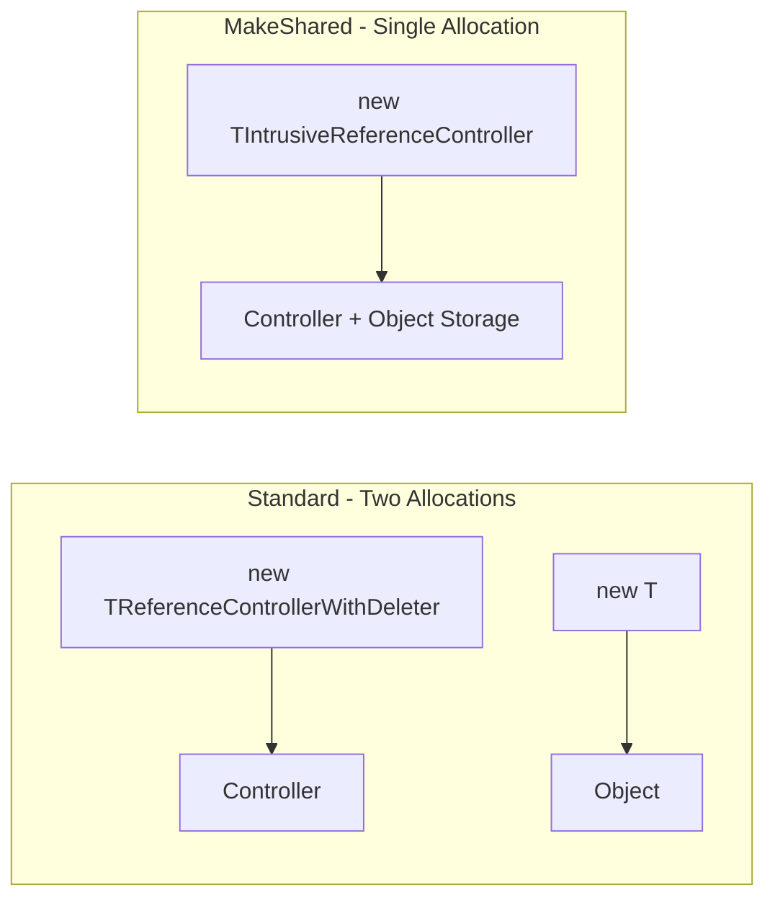
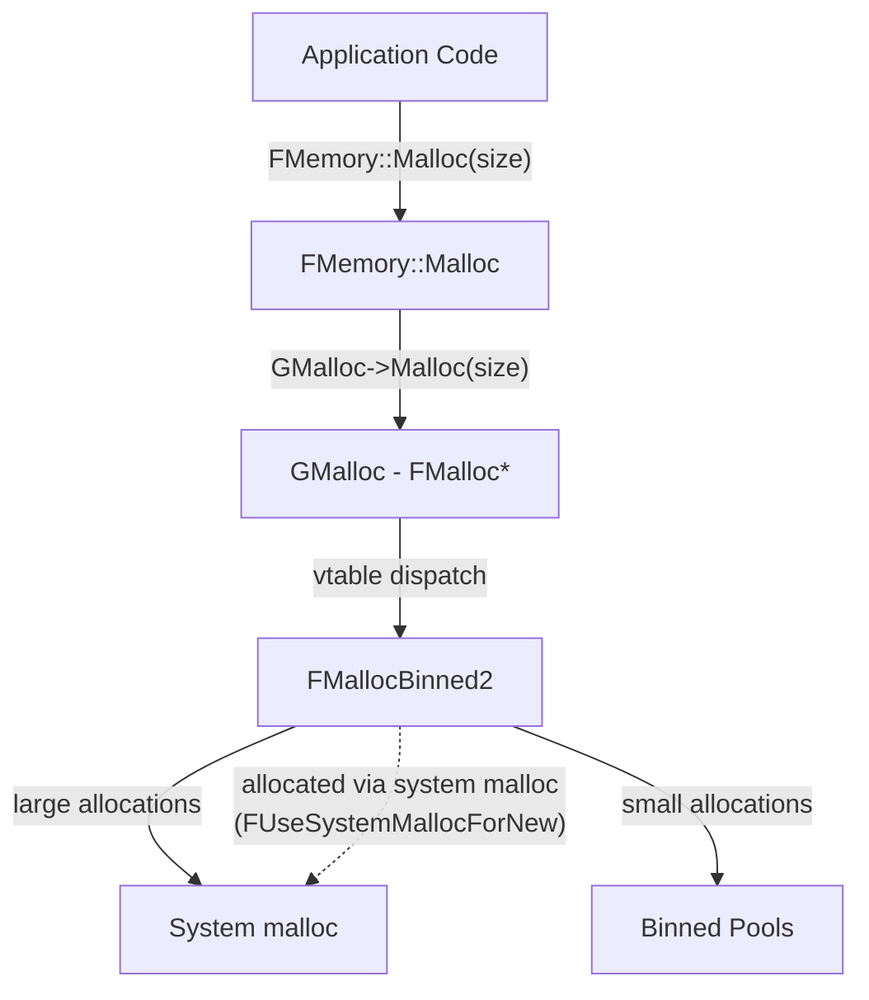
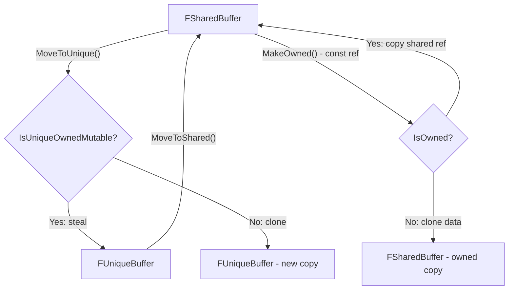
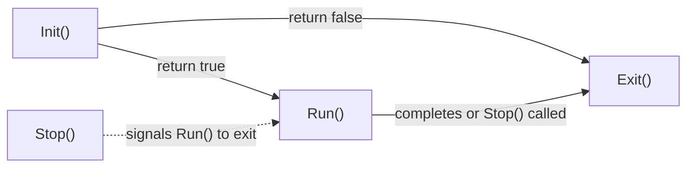

# UE Core Public — Core Mechanisms Deep Dive

> In-depth analysis of the fundamental mechanisms in `Engine/Source/Runtime/Core/Public/Memory`, `HAL`, and `Templates`

---

## Table of Contents

- [1. Reference Counting Mechanism](#1-reference-counting-mechanism)
  - [1.1 TSharedPtr/TSharedRef: Split Reference Controller](#11-tsharedptrtsharedref-split-reference-controller)
  - [1.2 FBufferOwner: Packed Atomic Reference Counts](#12-fbufferowner-packed-atomic-reference-counts)
  - [1.3 Thread-Safety as Compile-Time Policy](#13-thread-safety-as-compile-time-policy)
  - [1.4 Weak-to-Strong Promotion: CAS Loop](#14-weak-to-strong-promotion-cas-loop)
- [2. Memory Allocator Architecture](#2-memory-allocator-architecture)
  - [2.1 GMalloc Indirection and Bootstrapping](#21-gmalloc-indirection-and-bootstrapping)
  - [2.2 Allocator Decorator Chain](#22-allocator-decorator-chain)
  - [2.3 TLS Caching for Per-Thread Performance](#23-tls-caching-for-per-thread-performance)
  - [2.4 QuantizeSize: Eliminating Internal Fragmentation](#24-quantizesize-eliminating-internal-fragmentation)
- [3. Virtual Memory Allocator Patterns](#3-virtual-memory-allocator-patterns)
  - [3.1 FLinearAllocator: Reserve-Commit-Bump](#31-flinearallocator-reserve-commit-bump)
  - [3.2 FVirtualStackAllocator: LIFO with Decommit Policies](#32-fvirtualstackallocator-lifo-with-decommit-policies)
- [4. Arena-Based Memory Management](#4-arena-based-memory-management)
  - [4.1 Tagged Pointer Encoding](#41-tagged-pointer-encoding)
  - [4.2 Arena Dispatch Mechanism](#42-arena-dispatch-mechanism)
- [5. Buffer Ownership Model](#5-buffer-ownership-model)
  - [5.1 Packed Reference Counts + Flags in uint64](#51-packed-reference-counts--flags-in-uint64)
  - [5.2 Deferred Materialization](#52-deferred-materialization)
  - [5.3 Copy-on-Write via MakeOwned/MoveToUnique](#53-copy-on-write-via-makeownedmovetounique)
- [6. TFunction: Type-Erased Callable Storage](#6-tfunction-type-erased-callable-storage)
  - [6.1 Storage Policies: Inline vs Heap](#61-storage-policies-inline-vs-heap)
  - [6.2 TFunctionRef: Zero-Copy Non-Owning Binding](#62-tfunctionref-zero-copy-non-owning-binding)
  - [6.3 Unique vs Copyable Ownership](#63-unique-vs-copyable-ownership)
- [7. Type-Trait-Driven Container Optimizations](#7-type-trait-driven-container-optimizations)
  - [7.1 Bitwise Relocatability](#71-bitwise-relocatability)
  - [7.2 Zero-Construct Optimization](#72-zero-construct-optimization)
  - [7.3 Bytewise Comparability](#73-bytewise-comparability)
- [8. Console Variable Priority System](#8-console-variable-priority-system)
  - [8.1 Set Priority Hierarchy](#81-set-priority-hierarchy)
  - [8.2 Render Thread Shadow Copies](#82-render-thread-shadow-copies)
- [9. Platform Abstraction Mechanism](#9-platform-abstraction-mechanism)
  - [9.1 COMPILED_PLATFORM_HEADER Pattern](#91-compiled_platform_header-pattern)
  - [9.2 FPlatform* Static Interface Pattern](#92-fplatform-static-interface-pattern)
- [10. Thread Lifecycle Management](#10-thread-lifecycle-management)
  - [10.1 FRunnable Protocol](#101-frunnable-protocol)
  - [10.2 Atomic Memory Ordering Strategy](#102-atomic-memory-ordering-strategy)

---

## 1. Reference Counting Mechanism

### 1.1 TSharedPtr/TSharedRef: Split Reference Controller

The UE shared pointer system separates the **reference controller** from the **managed object**. This is the same design as `std::shared_ptr`.

**Architecture:**

```
TSharedPtr<T>
├── ObjectType* Object          ─── points to the managed object
└── FSharedReferencer<Mode>
    └── TReferenceControllerBase<Mode>*
        ├── RefCountType SharedReferenceCount  (starts at 1)
        ├── RefCountType WeakReferenceCount    (starts at 1)
        └── virtual DestroyObject()            (calls delete or custom deleter)
```

**Key design decisions in [`TReferenceControllerBase`](Engine/Source/Runtime/Core/Public/Templates/SharedPointerInternals.h:44):**

1. **Shared count starts at 1** — the first `TSharedPtr` that creates the controller already represents one reference, no need for increment-after-create.
2. **Weak count starts at 1** — this extra "1" represents "there are shared references alive". When shared count hits 0, weak count is decremented by 1. When weak count hits 0, the controller is deleted.
3. **Two-phase destruction**: When `SharedReferenceCount` → 0: `DestroyObject()` is called (destructs the managed object). When `WeakReferenceCount` → 0: `delete this` on the controller itself.

**Controller variants:**

| Controller | Purpose |
|---|---|
| [`TReferenceControllerWithDeleter<T, D, Mode>`](Engine/Source/Runtime/Core/Public/Templates/SharedPointerInternals.h:374) | Holds an object pointer + custom deleter. Uses [`TDeleterHolder`](Engine/Source/Runtime/Core/Public/Templates/SharedPointerInternals.h:341) with Empty Base Optimization — if the deleter is empty, it costs zero bytes. |
| [`TIntrusiveReferenceController<T, Mode>`](Engine/Source/Runtime/Core/Public/Templates/SharedPointerInternals.h:398) | Used by `MakeShared<T>()`. Embeds the object directly via `TTypeCompatibleBytes<T>` — **single allocation** for both the controller and the object. Eliminates one heap allocation vs separate `new T` + `new Controller`. |



### 1.2 FBufferOwner: Packed Atomic Reference Counts

[`FBufferOwner`](Engine/Source/Runtime/Core/Public/Memory/SharedBuffer.h:51) uses a fundamentally different reference counting scheme than `TSharedPtr`:

**All state is packed into a single `std::atomic<uint64>`:**

```
Bits 63-60: Flags (Owned, Immutable, Materialized)
Bits 59-30: Weak reference count   (30 bits, max ~1 billion)
Bits 29-0:  Shared reference count (30 bits, max ~1 billion)
```

```cpp
// From SharedBuffer.h
static constexpr uint32 RefCountMask = 0x3fffffff;  // 30 bits
static constexpr inline uint32 GetSharedRefCount(uint64 v) { return uint32(v >> 0) & RefCountMask; }
static constexpr inline uint32 GetWeakRefCount(uint64 v)   { return uint32(v >> 30) & RefCountMask; }
static constexpr inline EBufferOwnerFlags GetFlags(uint64 v) { return EBufferOwnerFlags(v >> 60); }
```

**Why pack into a single atomic?**

- **Single atomic read** to check `IsUniqueOwnedMutable()` — needed for copy-on-write decisions
- **Reduced cache line contention** — both counts and flags in one 8-byte word
- **Atomic flag updates** via `fetch_or` without CAS loops

**Add/Release implementation:**

```cpp
// AddSharedReference: single atomic add
void AddSharedReference() {
    uint64 prev = ReferenceCountsAndFlags.fetch_add(SetSharedRefCount(1), relaxed);
    if (GetSharedRefCount(prev) == 0) {
        AddWeakReference();  // First shared ref adds implicit weak ref
    }
}

// ReleaseSharedReference: atomic sub with acq_rel ordering
void ReleaseSharedReference() {
    uint64 prev = ReferenceCountsAndFlags.fetch_sub(SetSharedRefCount(1), acq_rel);
    if (GetSharedRefCount(prev) == 1) {
        FreeBuffer();       // Last shared ref: free the buffer data
        ReleaseWeakReference();  // Remove the implicit weak ref
    }
}
```

### 1.3 Thread-Safety as Compile-Time Policy

**TSharedPtr uses `ESPMode` template parameter:**

```cpp
template <ESPMode Mode>
class TReferenceControllerBase {
    // Mode == ThreadSafe  → std::atomic<int32>
    // Mode == NotThreadSafe → plain int32
    using RefCountType = std::conditional_t<Mode == ESPMode::ThreadSafe, std::atomic<int32>, int32>;
};
```

When `Mode == NotThreadSafe`:
- `AddSharedReference()` → simple `++SharedReferenceCount`
- No atomic instructions, no memory barriers
- Maximum performance for single-threaded objects

When `Mode == ThreadSafe`:
- `AddSharedReference()` → `fetch_add(1, relaxed)` or `++` (MSVC x86 optimization)
- `ReleaseSharedReference()` → `fetch_sub(1, acq_rel)` to ensure destructor side-effects are visible
- `ConditionallyAddSharedReference()` → CAS loop

**MSVC x86 codegen optimization** (from [`SharedPointerInternals.h:113`](Engine/Source/Runtime/Core/Public/Templates/SharedPointerInternals.h:113)):
```cpp
#if defined(_MSC_VER) && (defined(_M_X64) || defined(_M_IX86))
    // lock inc (from ++) is better codegen than lock xadd (from fetch_add)
    ++SharedReferenceCount;
#else
    SharedReferenceCount.fetch_add(1, std::memory_order_relaxed);
#endif
```

### 1.4 Weak-to-Strong Promotion: CAS Loop

[`ConditionallyAddSharedReference()`](Engine/Source/Runtime/Core/Public/Templates/SharedPointerInternals.h:144) in TSharedPtr and [`TryAddSharedReference()`](Engine/Source/Runtime/Core/Public/Memory/SharedBuffer.h:713) in FBufferOwner both implement the same pattern:

```cpp
// TSharedPtr version
bool ConditionallyAddSharedReference() {
    int32 OriginalCount = SharedReferenceCount.load(relaxed);
    for (;;) {
        if (OriginalCount == 0) return false;  // Already expired
        if (SharedReferenceCount.compare_exchange_weak(
                OriginalCount, OriginalCount + 1, relaxed))
            return true;
        // CAS failed: OriginalCount was updated, retry
    }
}
```

**Critical invariant:** A shared count of 0 means the object has been destroyed. `compare_exchange_weak` ensures we never "revive" an expired object — if another thread decremented to 0 between our load and CAS, the CAS will fail and we'll see 0 on the retry.

---

## 2. Memory Allocator Architecture

### 2.1 GMalloc Indirection and Bootstrapping

[`FMalloc`](Engine/Source/Runtime/Core/Public/HAL/MemoryBase.h:96) is the abstract base for all allocators. The global allocator pointer `GMalloc` is stored in `UE::Private::GMalloc`.

**Bootstrapping problem:** The allocator itself needs to be allocated. Solution: [`FUseSystemMallocForNew`](Engine/Source/Runtime/Core/Public/HAL/MemoryBase.h:61) — `FMalloc` inherits from this, which overrides `operator new/delete` to use system `malloc/free`, bypassing GMalloc.



### 2.2 Allocator Decorator Chain

UE allocators follow the **Decorator pattern**. Each proxy wraps another `FMalloc`:

```
App → FMemory → FMallocPoisonProxy → FMallocLeakDetectionProxy → FMallocBinned2 → OS
```

Each proxy adds behavior (poisoning, leak tracking, replaying) without modifying the underlying allocator. The chain is configured at startup.

### 2.3 TLS Caching for Per-Thread Performance

The [`FMalloc`](Engine/Source/Runtime/Core/Public/HAL/MemoryBase.h:96) interface includes TLS cache management:

```cpp
virtual void SetupTLSCachesOnCurrentThread()     {}
virtual void MarkTLSCachesAsUsedOnCurrentThread() {}
virtual void MarkTLSCachesAsUnusedOnCurrentThread() {}
virtual void ClearAndDisableTLSCachesOnCurrentThread() {}
virtual void Trim(bool bTrimThreadCaches)         {}
```

Binned allocators maintain **per-thread free lists** in Thread-Local Storage. This eliminates lock contention for small allocations. The `MarkTLSCachesAsUnused` call signals sleeping threads, allowing `Trim()` to reclaim their caches without waking them.

### 2.4 QuantizeSize: Eliminating Internal Fragmentation

```cpp
virtual SIZE_T QuantizeSize(SIZE_T Count, uint32 Alignment) { return Count; }
```

Binned allocators round up to size-class boundaries. `QuantizeSize` tells the caller what actual size was allocated, so containers can use the extra space instead of wasting it. For example, `TArray` can use this to grow to the quantized size, getting extra capacity "for free."

---

## 3. Virtual Memory Allocator Patterns

### 3.1 FLinearAllocator: Reserve-Commit-Bump

[`FLinearAllocator`](Engine/Source/Runtime/Core/Public/Memory/LinearAllocator.h:16) implements a classic **bump allocator** backed by virtual memory:

```
Phase 1: Reserve         Phase 2: Commit on demand    Phase 3: Allocate (bump)
┌─────────────────┐      ┌──────┬──────────────┐      ┌──────┬──────────────┐
│   Reserved VA    │      │Commit│  Uncommitted  │      │Used │Free│Uncommitted│
│   (no physical   │  →   │ ted  │               │  →   │     │    │           │
│    memory)       │      │      │               │      │     │    │           │
└─────────────────┘      └──────┴──────────────┘      └──────┴──────────────┘
```

**State:**
- `VirtualMemory` — reserved address range from OS
- `Reserved` — total reserved size
- `Committed` — bytes of committed (backed by physical memory) pages
- `CurrentOffset` — current bump pointer position

**Allocation:** Align up `CurrentOffset`, commit new pages if needed, return pointer, advance offset. O(1) per allocation.

**No individual free.** Used for permanent/session-lifetime objects.

**Fallback:** On platforms without virtual memory support, [`FLinearBlockAllocator`](Engine/Source/Runtime/Core/Public/Memory/LinearAllocator.h:44) uses a linked list of malloc'ed blocks instead.

### 3.2 FVirtualStackAllocator: LIFO with Decommit Policies

[`FVirtualStackAllocator`](Engine/Source/Runtime/Core/Public/Memory/VirtualStackAllocator.h:71) provides stack-like allocation with RAII-based bulk free:

**State:**
```cpp
FPlatformVirtualMemoryBlock VirtualMemory;  // Reserved VA
void* NextAllocationStart;                  // Current stack top (bump pointer)
void* NextUncommittedPage;                  // Tracks committed region boundary
void* RecentHighWaterMark;                  // Peak usage for heuristic decommit
```

**Allocation:** Same as linear allocator — commit pages as needed, bump pointer up.

**Free via Bookmark:** [`FScopedStackAllocatorBookmark`](Engine/Source/Runtime/Core/Public/Memory/VirtualStackAllocator.h:46) saves the current stack position on construction, restores it on destruction:

```cpp
// On destruction:
NextAllocationStart = RestorePointer;  // Instant bulk free!
if (stack empty && decommit mode != AllOnDestruction) {
    DecommitUnusedPages();
}
```

**Decommit policies ([`EVirtualStackAllocatorDecommitMode`](Engine/Source/Runtime/Core/Public/Memory/VirtualStackAllocator.h:33)):**

| Mode | Behavior |
|---|---|
| `AllOnDestruction` | Keep all committed pages until allocator destroyed. Best performance. |
| `AllOnStackEmpty` | Decommit everything when stack becomes empty. Returns memory to OS. |
| `ExcessOnStackEmpty` | Heuristic: tracks `RecentHighWaterMark`, decommits only pages above the recent steady-state usage. Avoids thrashing for spike patterns. |

**ASAN integration:** On free, memory is poisoned via `ASAN_POISON_MEMORY_REGION` to detect use-after-free.

---

## 4. Arena-Based Memory Management

### 4.1 Tagged Pointer Encoding

[`FArenaPointer`](Engine/Source/Runtime/Core/Public/Memory/MemoryArena.h:41) packs an arena ID into the unused upper bits of a 64-bit pointer:

```
64-bit pointer layout:
┌────────┬──────────────────────────────────────────────────┐
│ 16-bit │                    48-bit                        │
│ArenaID │              Virtual Address                     │
└────────┴──────────────────────────────────────────────────┘
  Bits 63-48              Bits 47-0
```

```cpp
static constexpr int    ArenaShift  = 48;
static constexpr uint64 ArenaMask   = 0xffff000000000000;
static constexpr uint64 PointerMask = 0x0000ffffFFFFffff;

uint16 GetArenaIndex() const { return uint16(UPTRINT(TaggedPointer) >> ArenaShift); }
void*  GetPointer()          { return reinterpret_cast<void*>(UPTRINT(TaggedPointer) & PointerMask); }
```

**Why this works:** Current x86-64 and ARM64 architectures only use 48 bits for virtual addresses (or 57 with 5-level paging, but UE guards against this). The upper 16 bits are free to encode metadata.

**Zero overhead** — same size as a regular pointer on 64-bit. On 32-bit, falls back to separate pointer + uint16.

### 4.2 Arena Dispatch Mechanism

[`FMemoryArena`](Engine/Source/Runtime/Core/Public/Memory/MemoryArena.h:103) uses the **Template Method** pattern:

```cpp
class FMemoryArena {
public:
    void* Alloc(SIZE_T Size, SIZE_T Alignment);   // public API
    void  Free(const void* MemoryBlock);            // public API
private:
    virtual void* InternalAlloc(SIZE_T Size, SIZE_T Alignment) = 0;  // override point
    virtual void  InternalFree(const void* MemoryBlock, SIZE_T MemoryBlockSize);
    virtual SIZE_T InternalGetBlockSize(const void* MemoryBlock) const = 0;
};
```

Concrete arenas:
- [`FMallocArena`](Engine/Source/Runtime/Core/Public/Memory/MemoryArena.h:171) → routes to `FMemory::Malloc/Free` (GMalloc)
- [`FAnsiArena`](Engine/Source/Runtime/Core/Public/Memory/MemoryArena.h:189) → routes to CRT `malloc/free`
- [`FHeapArena`](Engine/Source/Runtime/Core/Public/Memory/MemoryArena.h:150) → routes to OS heap API (e.g., `HeapAlloc/HeapFree`)

**Free dispatch:** `FArenaPointer::Free()` extracts the arena ID, looks up the arena, and calls `Arena().Free(GetPointer())`.

---

## 5. Buffer Ownership Model

### 5.1 Packed Reference Counts + Flags in uint64

As detailed in [Section 1.2](#12-fbufferowner-packed-atomic-reference-counts), `FBufferOwner` packs two 30-bit reference counts and 4-bit flags into one atomic uint64.

The key insight for the **`IsUniqueOwnedMutable()`** check:

```cpp
bool IsUniqueOwnedMutable() const {
    const uint64 RefCountsAndFlags = ReferenceCountsAndFlags.load(relaxed);
    return GetTotalRefCount(RefCountsAndFlags) == 1 &&
        (GetFlags(RefCountsAndFlags) & (Owned | Immutable)) == Owned;
}
```

This is a **single atomic load** to determine if:
1. Only one reference exists (total = shared + weak - overlap)
2. The buffer is owned (not a view)
3. The buffer is NOT immutable

This determines whether `MoveToUnique()` can steal the buffer or must clone it.

### 5.2 Deferred Materialization

`FBufferOwner` supports lazy initialization of buffer data:

```cpp
virtual void MaterializeBuffer();  // Override to implement lazy init

void* GetData() {
    Materialize();  // Calls MaterializeBuffer() if not yet materialized
    return Data;
}

void Materialize() {
    if (!IsMaterialized()) {
        MaterializeBuffer();   // Subclass fills in Data and Size
        checkSlow(IsMaterialized());
    }
}
```

The `Materialized` flag uses `memory_order_acquire` on read and `memory_order_release` on write, ensuring that the data written during materialization is visible to all threads that see the flag as set.

### 5.3 Copy-on-Write via MakeOwned/MoveToUnique



---

## 6. TFunction: Type-Erased Callable Storage

### 6.1 Storage Policies: Inline vs Heap

[`TFunction`](Engine/Source/Runtime/Core/Public/Templates/Function.h:638) uses type erasure to store arbitrary callables. The storage has two tiers:

```cpp
struct FFunctionStorage {
    #if TFUNCTION_USES_INLINE_STORAGE
        alignas(TFUNCTION_INLINE_ALIGNMENT) uint8 InlineAllocation[TFUNCTION_INLINE_SIZE];
    #endif
    void* HeapAllocation;
};
```

**Binding decision:**
```cpp
template <typename FunctorType>
DecayedFunctorType* Bind(FunctorType&& InFunc) {
    constexpr bool bOnHeap = sizeof(OwnedObject<Functor>) > TFUNCTION_INLINE_SIZE;

    if constexpr (!bOnHeap) {
        NewAlloc = &InlineAllocation;  // No heap allocation!
    } else {
        NewAlloc = FMemory::Malloc(sizeof(OwnedType), alignof(OwnedType));
        HeapAllocation = NewAlloc;
    }
    new (NewAlloc) OwnedType(Forward<FunctorType>(InFunc));
}
```

Small functors (e.g., function pointers, small lambdas) fit in inline storage — **zero heap allocations**. Large functors fall back to heap.

### 6.2 TFunctionRef: Zero-Copy Non-Owning Binding

[`TFunctionRef`](Engine/Source/Runtime/Core/Public/Templates/Function.h:555) uses [`FFunctionRefStoragePolicy`](Engine/Source/Runtime/Core/Public/Templates/Function.h:457):

```cpp
struct FFunctionRefStoragePolicy {
    static constexpr bool bCanBeNull = false;  // Always valid!

    template <typename FunctorType>
    auto* Bind(FunctorType&& InFunc) {
        Ptr = (void*)&InFunc;  // Just store address — no copy!
        return &InFunc;
    }

    void Unbind() const { /* No-op: doesn't own anything */ }

    void* Ptr;
};
```

Size: just two pointers (function pointer + callable pointer). No allocation, no virtual calls for storage management.

### 6.3 Unique vs Copyable Ownership

| Type | Storage | Copy | Clone |
|---|---|---|---|
| `TFunctionRef` | `FFunctionRefStoragePolicy` (non-owning pointer) | Copies pointer | N/A |
| `TFunction` | `TFunctionStorage<false>` (owning, copyable) | Calls `CloneToEmptyStorage()` | Deep copy of callable |
| `TUniqueFunction` | `TFunctionStorage<true>` (owning, move-only) | Deleted | N/A |

In [`TFunction_OwnedObject::CloneToEmptyStorage()`](Engine/Source/Runtime/Core/Public/Templates/Function.h:250):
```cpp
if constexpr (bUnique) {
    check(false);  // Should never be called for TUniqueFunction
} else {
    // Allocate new storage and copy-construct the callable
}
```

---

## 7. Type-Trait-Driven Container Optimizations

[`MemoryOps.h`](Engine/Source/Runtime/Core/Public/Templates/MemoryOps.h) provides container element operations that select **optimal codegen at compile time** based on type traits:

### 7.1 Bitwise Relocatability

```cpp
template <typename Dest, typename Src>
constexpr bool TCanBitwiseRelocate_V =
    std::is_same_v<Dest, Src> || (
        TIsBitwiseConstructible<Dest, Src>::Value &&
        std::is_trivially_destructible_v<Src>
    );
```

**If bitwisely relocatable:**
```cpp
// RelocateConstructItems — single Memmove instead of loop of move+destruct
FMemory::Memmove(Dest, Source, sizeof(SourceElementType) * Count);
```

**If not bitwisely relocatable:**
```cpp
while (Count) {
    new (Dest) DestType(std::move(*Source));  // Move construct
    Source->~SourceType();                     // Destruct source
    ++Dest; ++Source; --Count;
}
```

This is the **single most impactful optimization** for container operations like `TArray::Add()`, `TArray::Insert()`, and `TArray::Remove()`. For trivial types, growing an array is a single `memcpy`.

### 7.2 Zero-Construct Optimization

```cpp
// TIsZeroConstructType<T> == true  → memset to zero
template <typename ElementType, typename SizeType>
    requires (!!TIsZeroConstructType<ElementType>::Value)
void DefaultConstructItems(void* Address, SizeType Count) {
    FMemory::Memset(Address, 0, sizeof(ElementType) * Count);
}

// TIsZeroConstructType<T> == false  → placement new loop
template <typename ElementType, typename SizeType>
    requires (!TIsZeroConstructType<ElementType>::Value)
void DefaultConstructItems(void* Address, SizeType Count) {
    while (Count--) { new (Element++) ElementType; }
}
```

Types like `TSharedPtr`, `TUniquePtr`, raw pointers, and integers are zero-constructible — their default state is all-zeroes. Containers exploit this for fast initialization.

### 7.3 Bytewise Comparability

```cpp
// TTypeTraits<T>::IsBytewiseComparable → single memcmp
bool CompareItems(const T* A, const T* B, SizeType Count) {
    return !FMemory::Memcmp(A, B, sizeof(T) * Count);
}

// Otherwise → element-by-element comparison
bool CompareItems(const T* A, const T* B, SizeType Count) {
    while (Count--) { if (!(*A++ == *B++)) return false; }
    return true;
}
```

---

## 8. Console Variable Priority System

### 8.1 Set Priority Hierarchy

[`IConsoleManager.h`](Engine/Source/Runtime/Core/Public/HAL/IConsoleManager.h) defines `EConsoleVariableFlags` with a **Set-By priority** embedded in the flags:

```
Priority (low → high):
  SetByConstructor
  SetByScalability
  SetByGameSetting
  SetByProjectSetting
  SetByDeviceProfile
  SetBySystemSettingsIni
  SetByConsoleVariablesIni
  SetByCommandline
  SetByCode
  SetByConsole
```

When `Set()` is called with a given priority, the new value is **only applied if the priority is >= the current set-by priority**. This prevents, for example, a config file from overriding a command-line setting.

```cpp
// Conceptual implementation:
void Set(T NewValue, EConsoleVariableFlags SetByFlags) {
    if (GetSetByPriority(SetByFlags) >= GetSetByPriority(CurrentFlags)) {
        Value = NewValue;
        CurrentFlags = SetByFlags;
    }
}
```

### 8.2 Render Thread Shadow Copies

[`TConsoleVariableData<T>`](Engine/Source/Runtime/Core/Public/HAL/IConsoleManager.h) maintains **two copies** of the value:

```cpp
template <typename T>
class TConsoleVariableData {
    T ValueOnGameThread;      // Written on game thread
    T ShadowedValue[2];       // Double-buffered for render thread
    // ...
    T GetValueOnRenderThread() const { return ShadowedValue[GetShadowIndex()]; }
    T GetValueOnGameThread() const   { return ValueOnGameThread; }
};
```

This avoids locks between game and render threads. The render thread reads from a shadow copy that's updated at synchronization points.

---

## 9. Platform Abstraction Mechanism

### 9.1 COMPILED_PLATFORM_HEADER Pattern

UE's platform abstraction uses **compile-time header selection** rather than runtime polymorphism:

```cpp
// PlatformMemory.h:
#include COMPILED_PLATFORM_HEADER(PlatformMemory.h)
```

The `COMPILED_PLATFORM_HEADER` macro expands to platform-specific paths:
- Windows → `Windows/WindowsPlatformMemory.h`
- Linux → `Linux/LinuxPlatformMemory.h`
- Mac → `Mac/MacPlatformMemory.h`

**Each platform header defines a class that inherits from the generic implementation:**

```
FGenericPlatformMemory
    └── FWindowsPlatformMemory (typedef'd to FPlatformMemory)
```

### 9.2 FPlatform* Static Interface Pattern

Platform functions are **static methods on a typedef'd class**, not virtual functions:

```cpp
class FPlatformMemory : public FWindowsPlatformMemory { ... };

// Usage: FPlatformMemory::BinnedAllocFromOS(Size, ...);
```

**Why static instead of virtual?**
- Zero overhead: no vtable, no indirect call
- Fully inlineable
- Decided at compile time based on target platform
- No runtime dispatch needed since you only ever compile for one platform

---

## 10. Thread Lifecycle Management

### 10.1 FRunnable Protocol

[`FRunnable`](Engine/Source/Runtime/Core/Public/HAL/Runnable.h) defines a four-phase thread lifecycle:



1. **`Init()`** — Called on the new thread before `Run()`. Return false to abort.
2. **`Run()`** — The main thread function. Returns `uint32` exit code.
3. **`Stop()`** — Called from **any thread** to request graceful termination. Typically sets a flag that `Run()` checks.
4. **`Exit()`** — Called on the thread after `Run()` completes. Cleanup opportunity.

### 10.2 Atomic Memory Ordering Strategy

UE uses a consistent ordering strategy across all reference-counted types:

| Operation | Ordering | Rationale |
|---|---|---|
| **Increment** (AddRef) | `relaxed` | No action depends on the increment — safe to reorder. On MSVC x86, uses `++` (lock inc) instead of `fetch_add` (lock xadd) for better codegen. |
| **Decrement** (Release) | `acq_rel` | **Release**: ensures all prior writes (including destructor side-effects) are visible before the count reaches 0. **Acquire**: ensures that if we see count=1 (i.e., we're the last reference), we see all writes made by previous releasers before calling the destructor. |
| **Read count** | `relaxed` | A "live" reference count is inherently unstable — other threads can change it at any time. No ordering benefit. |
| **Conditional add (CAS)** | `relaxed` CAS | The CAS itself provides atomicity. If it fails, we retry. No side effects until success. |
| **Materialization flag read** | `acquire` | Must see all data written during materialization. |
| **Materialization flag write** | `release` | Must publish all data before the flag becomes visible. |

This is a **well-optimized pattern** — increment uses the cheapest ordering (relaxed), and only decrement pays for acq_rel, which is necessary only when destruction might occur.

---

## Summary of Core Design Principles

1. **Compile-time dispatch over runtime dispatch** — Platform abstraction uses typedef + static methods. Type traits select optimal MemoryOps paths. Thread-safety mode is a template parameter.

2. **Pack state into atomic words** — FBufferOwner packs refcounts + flags into uint64. FArenaPointer packs arena ID + pointer into a single pointer-sized value.

3. **Memory ordering discipline** — Relaxed for increments, acq_rel for decrements, acquire/release for publish patterns. MSVC-specific codegen optimizations for x86.

4. **Allocator composability** — FMalloc interface allows stacking proxy/decorator allocators for debugging/profiling without changing the production allocator.

5. **Virtual memory as first-class primitive** — Linear and stack allocators use reserve/commit/decommit for efficient memory management without fragmentation.

6. **Type traits as optimization gates** — Every container operation checks TIsZeroConstructType, TIsBitwiseConstructible, std::is_trivially_destructible etc. to select memcpy/memset paths over loop-based construction/destruction.
