# Unreal Engine Core Public API Analysis

> Analysis of classes in `Engine/Source/Runtime/Core/Public/Memory`, `Engine/Source/Runtime/Core/Public/HAL`, and `Engine/Source/Runtime/Core/Public/Templates`

---

## Table of Contents

- [1. Memory Directory](#1-memory-directory)
  - [1.1 MemoryFwd.h](#11-memoryfwdh)
  - [1.2 MemoryView.h](#12-memoryviewh)
  - [1.3 SharedBuffer.h](#13-sharedbufferh)
  - [1.4 CompositeBuffer.h](#14-compositebufferh)
  - [1.5 LinearAllocator.h](#15-linearallocatorh)
  - [1.6 MemoryArena.h](#16-memoryarenah)
  - [1.7 VirtualStackAllocator.h](#17-virtualstackallocatorh)
- [2. HAL Directory](#2-hal-directory)
  - [2.1 Platform & Compiler Fundamentals](#21-platform--compiler-fundamentals)
  - [2.2 Memory Allocators](#22-memory-allocators)
  - [2.3 Memory Tracking & Profiling](#23-memory-tracking--profiling)
  - [2.4 Virtual Memory & Page Management](#24-virtual-memory--page-management)
  - [2.5 Threading](#25-threading)
  - [2.6 Synchronization Primitives](#26-synchronization-primitives)
  - [2.7 Thread Utilities](#27-thread-utilities)
  - [2.8 File System](#28-file-system)
  - [2.9 Process Management](#29-process-management)
  - [2.10 Console Variable System](#210-console-variable-system)
  - [2.11 Platform Abstraction](#211-platform-abstraction)
  - [2.12 Output & Diagnostics](#212-output--diagnostics)
  - [2.13 Preprocessor & Misc Utilities](#213-preprocessor--misc-utilities)
- [3. Templates Directory](#3-templates-directory)
  - [3.1 Smart Pointers](#31-smart-pointers)
  - [3.2 Function Objects](#32-function-objects)
  - [3.3 Type Traits – Classification](#33-type-traits--classification)
  - [3.4 Type Traits – Property Queries](#34-type-traits--property-queries)
  - [3.5 Type Manipulation](#35-type-manipulation)
  - [3.6 Utility Templates](#36-utility-templates)
  - [3.7 Reference Counting & Ownership](#37-reference-counting--ownership)
  - [3.8 Container & Algorithm Support](#38-container--algorithm-support)
  - [3.9 Comparators & Projections](#39-comparators--projections)
  - [3.10 Miscellaneous](#310-miscellaneous)
- [4. Architecture Overview](#4-architecture-overview)

---

## 1. Memory Directory

**Path:** `Engine/Source/Runtime/Core/Public/Memory`

This directory provides high-level memory abstractions — non-owning views, reference-counted buffers, custom allocators, and arena-based memory management.

### 1.1 MemoryFwd.h

**File:** [`MemoryFwd.h`](Engine/Source/Runtime/Core/Public/Memory/MemoryFwd.h)

Forward declarations for all types in the Memory directory. Allows other headers to reference memory types without pulling in full definitions.

| Forward Declaration | Full Header |
|---|---|
| `TMemoryView<DataType>` | MemoryView.h |
| `FMemoryView` (alias for `TMemoryView<const void>`) | MemoryView.h |
| `FMutableMemoryView` (alias for `TMemoryView<void>`) | MemoryView.h |
| `FBufferOwner` | SharedBuffer.h |
| `FUniqueBuffer` | SharedBuffer.h |
| `FSharedBuffer` | SharedBuffer.h |
| `FWeakSharedBuffer` | SharedBuffer.h |
| `FCompositeBuffer` | CompositeBuffer.h |

---

### 1.2 MemoryView.h

**File:** [`MemoryView.h`](Engine/Source/Runtime/Core/Public/Memory/MemoryView.h)

A **non-owning view** of a contiguous memory range, analogous to `std::span`.

| Class/Alias | Description |
|---|---|
| `TMemoryView<DataType>` | Templated non-owning view over contiguous memory. Stores a `DataType*` pointer and a `uint64` size. Provides iteration, slicing (`Left`, `Right`, `Mid`, `LeftChop`, `RightChop`), containment checks, and comparison operators. `DataType` is typically `void` or `const void`. |
| `FMemoryView` | Alias for `TMemoryView<const void>` — immutable memory view |
| `FMutableMemoryView` | Alias for `TMemoryView<void>` — mutable memory view |

**Key Operations:**
- `GetData()` / `GetDataEnd()` — start/end pointers
- `GetSize()` — byte count
- `Left(Size)` / `Right(Size)` / `Mid(Offset, Size)` — sub-view slicing
- `Contains(View)` / `Intersects(View)` — spatial relationship queries
- `CompareBytes(View)` — lexicographic byte comparison

---

### 1.3 SharedBuffer.h

**File:** [`SharedBuffer.h`](Engine/Source/Runtime/Core/Public/Memory/SharedBuffer.h)

A reference-counted buffer ownership system, analogous to `std::shared_ptr` but for raw memory regions.

| Class | Description |
|---|---|
| `FBufferOwner` | Abstract base class for reference-counted buffer ownership. Packs shared reference count and weak reference count into a single `uint64` (high 31 bits = shared, low 31 bits = weak, bit 31 = materialized flag). Derived classes implement `FreeBuffer()`. |
| `TBufferOwnerDeleteFunction<DataType>` | `FBufferOwner` subclass that uses a caller-provided `TFunction` to free the buffer. |
| `TBufferOwnerTArray<DataType>` | `FBufferOwner` subclass that owns a `TArray<DataType>` and exposes its memory as a buffer. |
| `FUniqueBuffer` | Single-ownership mutable buffer. Wraps an `FBufferOwner*` and a `FMutableMemoryView`. Move-only. Can be promoted to `FSharedBuffer` via `MoveToShared()`. |
| `FSharedBuffer` | Shared-ownership immutable buffer. Multiple references to the same memory. Reference-counted via `FBufferOwner`. Provides `MakeOwned()` to guarantee unique ownership (copy-on-write). |
| `FWeakSharedBuffer` | Weak reference to a `FSharedBuffer`. Does not prevent deallocation. Can be promoted via `Pin()`. |

**Lifecycle:**
```
FUniqueBuffer (sole owner, mutable)
    │
    ├── MoveToShared() ──► FSharedBuffer (shared, immutable)
    │                          │
    │                          ├── ToWeak() ──► FWeakSharedBuffer
    │                          │                   │
    │                          │                   └── Pin() ──► FSharedBuffer (or null)
    │                          │
    │                          └── MakeOwned() ──► FUniqueBuffer (copy if shared)
    │
    └── (drop) ──► freed
```

---

### 1.4 CompositeBuffer.h

**File:** [`CompositeBuffer.h`](Engine/Source/Runtime/Core/Public/Memory/CompositeBuffer.h)

| Class | Description |
|---|---|
| `FCompositeBuffer` | A **non-contiguous buffer** composed of zero or more `FSharedBuffer` segments. Useful when concatenating buffers without copying. Provides `GetSize()` for total logical size and iteration over segments. Supports `Mid(Offset, Size)` for sub-range views across segment boundaries. |

---

### 1.5 LinearAllocator.h

**File:** [`LinearAllocator.h`](Engine/Source/Runtime/Core/Public/Memory/LinearAllocator.h)

Bump/linear allocators optimized for allocation-heavy, bulk-free patterns.

| Class | Description |
|---|---|
| `FLinearAllocator` | Virtual-memory-backed linear allocator. Reserves a large address range upfront, commits pages incrementally as allocations are made. Supports `Allocate(Size, Align)` and bulk `Reset()`. Very fast allocation (pointer bump), no individual deallocation. |
| `FLinearBlockAllocator` | Block-chain-based linear allocator. Allocates in fixed-size blocks linked together. Each allocation is a bump within the current block; when exhausted, a new block is allocated. Supports `Reset()` to free all blocks. |

---

### 1.6 MemoryArena.h

**File:** [`MemoryArena.h`](Engine/Source/Runtime/Core/Public/Memory/MemoryArena.h)

Arena-based memory management with tagged pointers for identifying the source arena.

| Class/Type | Description |
|---|---|
| `FMemoryArena` | Abstract base class for arena allocators. Defines `Alloc(Size, Align)`, `Free(Ptr, Size, Align)`, and `Contains(Ptr)`. Each arena instance has a unique arena ID (up to 256 arenas supported). |
| `FArenaPointer` | Tagged pointer that packs a raw pointer with an arena ID. The arena ID occupies the upper bits of the 64-bit value. Allows routing `Free()` to the correct arena without external bookkeeping. |
| `TArenaPointer<T>` | Typed wrapper around `FArenaPointer` providing `operator->()` and `operator*()`. |
| `FArenaMap` | Maps arena IDs to their `FMemoryArena*` instances. Global registry used by `FArenaPointer::Free()`. |
| `FMallocArena` | Concrete arena backed by `FMemory::Malloc/Free` (GMalloc). |
| `FAnsiArena` | Concrete arena backed by ANSI C `malloc/free`. |
| `FHeapArena` | Concrete arena backed by OS heap functions (Windows `HeapAlloc/HeapFree`). |

---

### 1.7 VirtualStackAllocator.h

**File:** [`VirtualStackAllocator.h`](Engine/Source/Runtime/Core/Public/Memory/VirtualStackAllocator.h)

Stack-style allocator backed by virtual memory.

| Class/Enum | Description |
|---|---|
| `FVirtualStackAllocator` | Stack-style allocator using virtual memory. Reserves a large address range, commits pages on demand. Allocations and frees must follow LIFO order. `Allocate(Size)` bumps the stack pointer up; `Free(Ptr, Size)` bumps it back down. Supports `SetBookmark()` / `FreeToBookmark()` for bulk free. |
| `FScopedStackAllocatorBookmark` | RAII scope guard that saves a bookmark on construction and frees to it on destruction — bulk free of all allocations within the scope. |
| `EVirtualStackAllocatorDecommitMode` | Controls page decommit behavior: `None` (keep committed), `PerFree` (decommit on each free), `PerBookmark` (decommit on bookmark restore). |

---

## 2. HAL Directory

**Path:** `Engine/Source/Runtime/Core/Public/HAL`

The Hardware Abstraction Layer provides platform-independent interfaces for memory allocation, threading, file I/O, process management, and system-level services.

### 2.1 Platform & Compiler Fundamentals

| File | Key Types | Description |
|---|---|---|
| [`Platform.h`](Engine/Source/Runtime/Core/Public/HAL/Platform.h) | `PLATFORM_*` macros, base types | Master platform detection/configuration header. Defines `uint8`–`uint64`, `int8`–`int64`, `TCHAR`, `UPTRINT`, `SSIZE_T`, `SIZE_T`. Sets `PLATFORM_WINDOWS`, `PLATFORM_LINUX`, `PLATFORM_MAC`, etc. Configures compiler intrinsics, alignment, cache line size, calling conventions, optimization hints. |
| [`PlatformCrt.h`](Engine/Source/Runtime/Core/Public/HAL/PlatformCrt.h) | — | Platform-specific C runtime header includes. Redirects to the correct platform's CRT configuration. |
| [`PlatformIncludes.h`](Engine/Source/Runtime/Core/Public/HAL/PlatformIncludes.h) | — | Platform-specific system header includes (windows.h, etc.). |
| [`PlatformProperties.h`](Engine/Source/Runtime/Core/Public/HAL/PlatformProperties.h) | `FPlatformProperties` | Static queries about platform capabilities: `HasEditorOnlyData()`, `IsServerOnly()`, `IsClientOnly()`, `SupportsGrayscaleSRGB()`, etc. |
| [`PlatformAffinity.h`](Engine/Source/Runtime/Core/Public/HAL/PlatformAffinity.h) | `FPlatformAffinity` | Thread affinity masks for various engine subsystems (game thread, render thread, audio, stats, etc.). |
| [`AllowTCHAR.h`](Engine/Source/Runtime/Core/Public/HAL/AllowTCHAR.h) | — | Re-enables TCHAR macros after `HideTCHAR.h`. Used around platform headers that conflict with UE's TCHAR. |
| [`HideTCHAR.h`](Engine/Source/Runtime/Core/Public/HAL/HideTCHAR.h) | — | Temporarily undefines TCHAR to avoid conflicts with platform headers. |

---

### 2.2 Memory Allocators

#### Core Allocator Interface

| File | Key Types | Description |
|---|---|---|
| [`MemoryBase.h`](Engine/Source/Runtime/Core/Public/HAL/MemoryBase.h) | `FMalloc`, `FUseSystemMallocForNew` | `FMalloc` is the abstract base class for all UE memory allocators. Defines virtual `Malloc(Size, Align)`, `Realloc(Ptr, NewSize, Align)`, `Free(Ptr)`, `QuantizeSize(Size, Align)`, `GetAllocationSize(Ptr)`, `IsInternallyThreadSafe()`, `ValidateHeap()`, `DumpAllocatorStats()`. `DEFAULT_ALIGNMENT = 0`, `MIN_ALIGNMENT = 16`. `FUseSystemMallocForNew` is a base class that overrides `operator new/delete` to use system malloc — used by allocator objects themselves to avoid circular dependency. |
| [`UnrealMemory.h`](Engine/Source/Runtime/Core/Public/HAL/UnrealMemory.h) | `FMemory`, `FScopedMallocTimer` | `FMemory` is a static utility struct wrapping `GMalloc`. Methods: `Malloc(Size, Align)`, `Realloc(Ptr, Size, Align)`, `Free(Ptr)`, `GetAllocSize(Ptr)`, `QuantizeSize(Size, Align)`, `Memcpy()`, `Memmove()`, `Memset()`, `Memzero()`, `Memcmp()`, `SystemMalloc()`, `SystemFree()`. `FScopedMallocTimer` — RAII timer for malloc profiling. |
| [`Memory.h`](Engine/Source/Runtime/Core/Public/HAL/Memory.h) | — | Includes `FMemory.inl` which provides inline implementations. Selects between a fixed `GMalloc` class (compile-time known allocator type) or a generic `FMalloc*` pointer (runtime-switchable). |

#### Binned Allocators (Production)

| File | Key Types | Description |
|---|---|---|
| [`MallocBinned.h`](Engine/Source/Runtime/Core/Public/HAL/MallocBinned.h) | `FMallocBinned` | **Legacy binned allocator (Gen 1)**. Uses size-class bins with pool-based allocation. Each bin corresponds to a range of allocation sizes. Good general-purpose performance. |
| [`MallocBinned2.h`](Engine/Source/Runtime/Core/Public/HAL/MallocBinned2.h) | `FMallocBinned2` | **Binned allocator Gen 2**. Improved version with better memory efficiency, smaller metadata overhead, and optimized small-allocation paths. Default allocator on many platforms. |
| [`MallocBinned3.h`](Engine/Source/Runtime/Core/Public/HAL/MallocBinned3.h) | `FMallocBinned3` | **Binned allocator Gen 3**. Latest generation with further optimizations for memory usage and fragmentation reduction. |
| [`MallocBinnedCommon.h`](Engine/Source/Runtime/Core/Public/HAL/MallocBinnedCommon.h) | — | Common utilities, constants, and data structures shared across all binned allocator generations. |
| [`MallocBinnedCommonUtils.h`](Engine/Source/Runtime/Core/Public/HAL/MallocBinnedCommonUtils.h) | — | Additional shared utility functions for binned allocators. |
| [`MallocBinnedGPU.h`](Engine/Source/Runtime/Core/Public/HAL/MallocBinnedGPU.h) | `FMallocBinnedGPU` | Specialized binned allocator for GPU-accessible memory. |

#### Third-Party Allocator Integrations

| File | Key Types | Description |
|---|---|---|
| [`MallocAnsi.h`](Engine/Source/Runtime/Core/Public/HAL/MallocAnsi.h) | `FMallocAnsi` | Wraps ANSI C runtime `malloc/realloc/free`. Simplest allocator, used as fallback or for platforms without custom allocator support. |
| [`MallocJemalloc.h`](Engine/Source/Runtime/Core/Public/HAL/MallocJemalloc.h) | `FMallocJemalloc` | Integration with **jemalloc** — a general-purpose scalable concurrent allocator. |
| [`MallocMimalloc.h`](Engine/Source/Runtime/Core/Public/HAL/MallocMimalloc.h) | `FMallocMimalloc` | Integration with **mimalloc** (Microsoft's compact general-purpose allocator). |
| [`MallocTBB.h`](Engine/Source/Runtime/Core/Public/HAL/MallocTBB.h) | `FMallocTBB` | Integration with Intel **TBB** (Threading Building Blocks) scalable allocator. |
| [`MallocLibpas.h`](Engine/Source/Runtime/Core/Public/HAL/MallocLibpas.h) | `FMallocLibpas` | Integration with Apple's **libpas** allocator. |

#### Debug & Diagnostic Allocators

| File | Key Types | Description |
|---|---|---|
| [`MallocStomp.h`](Engine/Source/Runtime/Core/Public/HAL/MallocStomp.h) | `FMallocStomp` | **Guard page allocator**. Places each allocation at the end of a page with a guard page immediately after (or before). Buffer overruns/underruns trigger an immediate access violation. Extremely slow but excellent for debugging memory corruption. |
| [`MallocStomp2.h`](Engine/Source/Runtime/Core/Public/HAL/MallocStomp2.h) | `FMallocStomp2` | Second-generation stomp allocator with additional features. |
| [`MallocDebug.h`](Engine/Source/Runtime/Core/Public/HAL/MallocDebug.h) | `FMallocDebug` | Debug allocator with additional validation, fill patterns, and tracking. |
| [`MallocDoubleFreeFinder.h`](Engine/Source/Runtime/Core/Public/HAL/MallocDoubleFreeFinder.h) | `FMallocDoubleFreeFinder` | Proxy allocator that detects double-free errors by maintaining a freed-pointer registry. |
| [`PlatformMallocCrash.h`](Engine/Source/Runtime/Core/Public/HAL/PlatformMallocCrash.h) | `FMallocCrash` / `FGenericPlatformMallocCrash` | Emergency allocator used during crash handling. Pre-allocates a fixed memory pool to allow crash reporting to proceed even when the primary allocator is corrupted. |

#### Proxy & Wrapper Allocators

| File | Key Types | Description |
|---|---|---|
| [`MallocPoisonProxy.h`](Engine/Source/Runtime/Core/Public/HAL/MallocPoisonProxy.h) | `FMallocPoisonProxy` | Proxy that fills freed memory with a poison pattern (e.g., `0xCD`) to catch use-after-free bugs. Wraps any `FMalloc`. |
| [`MallocReplayProxy.h`](Engine/Source/Runtime/Core/Public/HAL/MallocReplayProxy.h) | `FMallocReplayProxy` | Proxy that records/replays allocation sequences. Used for reproducing memory-related issues. |
| [`MallocThreadSafeProxy.h`](Engine/Source/Runtime/Core/Public/HAL/MallocThreadSafeProxy.h) | `FMallocThreadSafeProxy` | Proxy that adds thread-safety (locking) around a non-thread-safe allocator. |

#### Profiling & Leak Detection Allocators

| File | Key Types | Description |
|---|---|---|
| [`MallocLeakDetection.h`](Engine/Source/Runtime/Core/Public/HAL/MallocLeakDetection.h) | `FMallocLeakDetection` | Tracks all live allocations and can report likely leaks by comparing snapshots. |
| [`MallocLeakDetectionProxy.h`](Engine/Source/Runtime/Core/Public/HAL/MallocLeakDetectionProxy.h) | `FMallocLeakDetectionProxy` | Proxy wrapper for leak detection functionality. |
| [`MallocCallstackHandler.h`](Engine/Source/Runtime/Core/Public/HAL/MallocCallstackHandler.h) | `FMallocCallstackHandler` | Records callstacks for allocations to help identify allocation sources. |
| [`MallocFrameProfiler.h`](Engine/Source/Runtime/Core/Public/HAL/MallocFrameProfiler.h) | `FMallocFrameProfiler` | Per-frame memory profiling — tracks allocations per game frame. |
| [`MallocTimer.h`](Engine/Source/Runtime/Core/Public/HAL/MallocTimer.h) | `FMallocTimer` | Times individual allocation operations for performance analysis. |

---

### 2.3 Memory Tracking & Profiling

| File | Key Types | Description |
|---|---|---|
| [`LowLevelMemTracker.h`](Engine/Source/Runtime/Core/Public/HAL/LowLevelMemTracker.h) | `FLowLevelMemTracker` (LLM) | **Low Level Memory Tracker** — engine-wide memory tracking system. Tags every allocation with a category (Meshes, Textures, Audio, etc.) and reports per-category memory usage. Works at the allocator level. |
| [`LowLevelMemTrackerDefines.h`](Engine/Source/Runtime/Core/Public/HAL/LowLevelMemTrackerDefines.h) | `ELLMTag`, `LLM_SCOPE` | Defines all LLM tag enums and scope macros for memory tracking. |
| [`LowLevelMemStats.h`](Engine/Source/Runtime/Core/Public/HAL/LowLevelMemStats.h) | — | Statistics collection and reporting for LLM data. |

---

### 2.4 Virtual Memory & Page Management

| File | Key Types | Description |
|---|---|---|
| [`PlatformMemory.h`](Engine/Source/Runtime/Core/Public/HAL/PlatformMemory.h) | `FPlatformMemory` | Platform abstraction for memory operations: `BinnedAllocFromOS()`, `BinnedFreeToOS()`, `PageProtect()`, `GetPhysicalGBRam()`, `GetStats()`, address space reservation. Redirects to platform-specific implementation via `COMPILED_PLATFORM_HEADER`. |
| [`PageCache.h`](Engine/Source/Runtime/Core/Public/HAL/PageCache.h) | `FPageCache` | Caches freed OS pages for reuse instead of returning them to the OS immediately. Reduces system call overhead. |
| [`VirtualAllocator.h`](Engine/Source/Runtime/Core/Public/HAL/VirtualAllocator.h) | `FVirtualAllocator` | Higher-level virtual memory management. Manages address space reservation and commit/decommit of virtual memory pages. |

---

### 2.5 Threading

#### Thread Abstraction

| File | Key Types | Description |
|---|---|---|
| [`Runnable.h`](Engine/Source/Runtime/Core/Public/HAL/Runnable.h) | `FRunnable` | Abstract interface for objects that run on threads. Defines the thread lifecycle: `Init()` → `Run()` → `Stop()` → `Exit()`. Override `Run()` with your work. `Stop()` is called to request graceful termination. |
| [`RunnableThread.h`](Engine/Source/Runtime/Core/Public/HAL/RunnableThread.h) | `FRunnableThread` | OS thread wrapper. Created via `FRunnableThread::Create(Runnable, Name, StackSize, Priority, Affinity)`. Provides `SetThreadPriority()`, `Suspend(bool)`, `Kill(bShouldWait)`, `WaitForCompletion()`. Thread types: `Real` (OS thread), `Fake` (runs on caller thread), `Forkable` (handle fork-safe re-creation). |
| [`Thread.h`](Engine/Source/Runtime/Core/Public/HAL/Thread.h) | `FThread` | **Simplified thread API** wrapping `FRunnable`/`FRunnableThread`. Takes a callable (lambda/function) in the constructor. Supports `Join()` and `Detach()` semantics similar to `std::thread`. |
| [`ThreadingBase.h`](Engine/Source/Runtime/Core/Public/HAL/ThreadingBase.h) | — | Aggregate include header that pulls in all threading-related headers (Runnable, RunnableThread, synchronization primitives, etc.). |

#### Thread Priority & Type

`EThreadPriority` values: `TPri_TimeCritical`, `TPri_Highest`, `TPri_AboveNormal`, `TPri_Normal`, `TPri_BelowNormal`, `TPri_Lowest`, `TPri_SlightlyBelowNormal`

---

### 2.6 Synchronization Primitives

| File | Key Types | Description |
|---|---|---|
| [`CriticalSection.h`](Engine/Source/Runtime/Core/Public/HAL/CriticalSection.h) | `FCriticalSection`, `FRWLock`, `FSystemWideCriticalSection` | `FCriticalSection` — alias for `FPlatformRecursiveMutex` (platform recursive mutex). `FRWLock` — adapter around `FPlatformSharedMutex` providing `ReadLock()/ReadUnlock()/WriteLock()/WriteUnlock()`. `FSystemWideCriticalSection` — cross-process named mutex for inter-process synchronization. |
| [`Event.h`](Engine/Source/Runtime/Core/Public/HAL/Event.h) | `FEvent`, `FEventRef`, `FSharedEventRef`, `EEventMode` | `FEvent` — waitable event (manual-reset or auto-reset). `Wait(WaitTime)`, `Trigger()`, `Reset()`. `FEventRef` — RAII wrapper that returns events to a pool on destruction. `FSharedEventRef` — shared (ref-counted) version. `EEventMode::AutoReset` / `ManualReset`. |
| [`PlatformMutex.h`](Engine/Source/Runtime/Core/Public/HAL/PlatformMutex.h) | `FPlatformRecursiveMutex`, `FPlatformSharedMutex` | Platform-specific mutex implementations. Redirects to the appropriate platform header. |
| [`PThreadsRecursiveMutex.h`](Engine/Source/Runtime/Core/Public/HAL/PThreadsRecursiveMutex.h) | `FPThreadsRecursiveMutex` | POSIX pthreads-based recursive mutex. |
| [`PThreadsSharedMutex.h`](Engine/Source/Runtime/Core/Public/HAL/PThreadsSharedMutex.h) | `FPThreadsSharedMutex` | POSIX pthreads-based reader-writer (shared) mutex. |
| [`PThreadEvent.h`](Engine/Source/Runtime/Core/Public/HAL/PThreadEvent.h) | `FPThreadEvent` | POSIX pthreads-based event implementation using `pthread_cond_t`. |
| [`PThreadSemaphore.h`](Engine/Source/Runtime/Core/Public/HAL/PThreadSemaphore.h) | `FPThreadSemaphore` | POSIX pthreads-based semaphore. |
| [`UESemaphore.h`](Engine/Source/Runtime/Core/Public/HAL/UESemaphore.h) | `FUESemaphore` | UE abstraction for OS semaphores. |
| [`PooledSyncEvent.h`](Engine/Source/Runtime/Core/Public/HAL/PooledSyncEvent.h) | — | Pool of reusable `FEvent` objects to reduce OS resource creation/destruction overhead. |

---

### 2.7 Thread Utilities

| File | Key Types | Description |
|---|---|---|
| [`ThreadSafeBool.h`](Engine/Source/Runtime/Core/Public/HAL/ThreadSafeBool.h) | `FThreadSafeBool` | Atomic boolean wrapper. Thread-safe read/write without explicit locking. |
| [`ThreadSafeCounter.h`](Engine/Source/Runtime/Core/Public/HAL/ThreadSafeCounter.h) | `FThreadSafeCounter` | Atomic 32-bit integer counter. `Increment()`, `Decrement()`, `Set()`, `GetValue()`. |
| [`ThreadSafeCounter64.h`](Engine/Source/Runtime/Core/Public/HAL/ThreadSafeCounter64.h) | `FThreadSafeCounter64` | Atomic 64-bit integer counter. |
| [`ThreadSingleton.h`](Engine/Source/Runtime/Core/Public/HAL/ThreadSingleton.h) | `TThreadSingleton<T>` | Template for thread-local singletons — one instance per thread, lazily created. |
| [`TlsAutoCleanup.h`](Engine/Source/Runtime/Core/Public/HAL/TlsAutoCleanup.h) | `FTlsAutoCleanup` | Base class for TLS-stored objects that are automatically destroyed when the thread exits. |
| [`ThreadHeartBeat.h`](Engine/Source/Runtime/Core/Public/HAL/ThreadHeartBeat.h) | `FThreadHeartBeat` | Thread health monitoring system. Detects threads that have stopped responding (hung threads). |
| [`ThreadManager.h`](Engine/Source/Runtime/Core/Public/HAL/ThreadManager.h) | `FThreadManager` | Global registry and manager for all `FRunnableThread` instances. Supports thread enumeration and fork handling. |

---

### 2.8 File System

| File | Key Types | Description |
|---|---|---|
| [`PlatformFile.h`](Engine/Source/Runtime/Core/Public/HAL/PlatformFile.h) | — | Platform redirect header for file system implementation. |
| [`PlatformFileCommon.h`](Engine/Source/Runtime/Core/Public/HAL/PlatformFileCommon.h) | — | Common types and constants for platform file operations. |
| [`PlatformFileManager.h`](Engine/Source/Runtime/Core/Public/HAL/PlatformFileManager.h) | `FPlatformFileManager` | Singleton manager for `IPlatformFile` instances. Manages a stack of platform file wrappers (e.g., cached, logged, managed). |
| [`IPlatformFile.h`](Engine/Source/Runtime/Core/Public/HAL/IPlatformFile.h) | `IPlatformFile`, `IFileHandle` | Core file system interface. `IPlatformFile` — abstract interface for file operations: `OpenRead()`, `OpenWrite()`, `FileExists()`, `DirectoryExists()`, `DeleteFile()`, `MoveFile()`, `FileSize()`, `IterateDirectory()`, `GetTimeStamp()`. `IFileHandle` — abstract handle for an open file: `Read()`, `Write()`, `Seek()`, `Tell()`, `Size()`, `Flush()`. |
| [`IPlatformFileCachedWrapper.h`](Engine/Source/Runtime/Core/Public/HAL/IPlatformFileCachedWrapper.h) | `FCachedFileHandle` | Wrapper around `IFileHandle` adding read caching for sequential access patterns. |
| [`IPlatformFileLogWrapper.h`](Engine/Source/Runtime/Core/Public/HAL/IPlatformFileLogWrapper.h) | `FLoggedPlatformFile` | `IPlatformFile` wrapper that logs all file operations for debugging. |
| [`IPlatformFileManagedStorageWrapper.h`](Engine/Source/Runtime/Core/Public/HAL/IPlatformFileManagedStorageWrapper.h) | `FManagedStoragePlatformFile` | Wrapper for platforms with managed storage (e.g., cloud saves). |
| [`IPlatformFileOpenLogWrapper.h`](Engine/Source/Runtime/Core/Public/HAL/IPlatformFileOpenLogWrapper.h) | `FPlatformFileOpenLog` | Logs which files are opened — useful for packaging/cook dependency tracking. |
| [`FileManager.h`](Engine/Source/Runtime/Core/Public/HAL/FileManager.h) | `IFileManager` | Legacy singleton for high-level file operations: `CreateFileReader()`, `CreateFileWriter()`, `Copy()`, `Move()`, `Delete()`, `MakeDirectory()`, `FindFiles()`, `FindFilesRecursive()`, `IterateDirectory()`, `IterateDirectoryRecursive()`, `GetTimeStamp()`. Wraps `IPlatformFile`. |
| [`FileManagerGeneric.h`](Engine/Source/Runtime/Core/Public/HAL/FileManagerGeneric.h) | `FFileManagerGeneric` | Generic cross-platform implementation of `IFileManager`. |

---

### 2.9 Process Management

| File | Key Types | Description |
|---|---|---|
| [`PlatformProcess.h`](Engine/Source/Runtime/Core/Public/HAL/PlatformProcess.h) | `FPlatformProcess`, `FProcess`, `FPipe`, `FInputPipe`, `FOutputPipe` | `FPlatformProcess` — static utility for process operations: `CreateProc()`, `IsProcRunning()`, `GetCurrentProcessId()`, `Sleep()`, `SleepNoStats()`, `LaunchURL()`, `GetDllHandle()`, `GetDllExport()`, `FreeDllHandle()`. `FProcess` — RAII wrapper for child processes (wait, terminate, get return code). `FPipe/FInputPipe/FOutputPipe` — pipe abstractions for inter-process communication. |
| [`PlatformNamedPipe.h`](Engine/Source/Runtime/Core/Public/HAL/PlatformNamedPipe.h) | `FPlatformNamedPipe` | Named pipe abstraction for inter-process communication. |

---

### 2.10 Console Variable System

| File | Key Types | Description |
|---|---|---|
| [`IConsoleManager.h`](Engine/Source/Runtime/Core/Public/HAL/IConsoleManager.h) | `IConsoleManager`, `IConsoleObject`, `IConsoleVariable`, `IConsoleCommand`, `FAutoConsoleVariable`, `FAutoConsoleVariableRef`, `TAutoConsoleVariable<T>`, `FAutoConsoleCommand`, `TConsoleVariableData<T>`, `EConsoleVariableFlags`, `TGuardConsoleVariable<T>` | **Console Variable (CVar) System** — The core runtime configuration system. |
| [`ConsoleManager.h`](Engine/Source/Runtime/Core/Public/HAL/ConsoleManager.h) | `FConsoleManager` | Concrete implementation of `IConsoleManager`. |

**Key types in detail:**

- **`IConsoleManager`** — Singleton interface. `RegisterConsoleVariable()`, `RegisterConsoleCommand()`, `FindConsoleVariable()`, `UnregisterConsoleObject()`, `ForEachConsoleObjectThatStartsWith()`.
- **`IConsoleObject`** — Base for all console objects. Has a help text and `EConsoleVariableFlags`.
- **`IConsoleVariable`** — Interface for console variables. `GetInt()`, `GetFloat()`, `GetString()`, `GetBool()`, `Set(Value)`, `SetWithCurrentPriority()`. Supports a priority system (`EConsoleVariableFlags::SetBy*`) where higher-priority sets override lower ones.
- **`IConsoleCommand`** — Interface for console commands. `Execute(Args, World, OutputDevice)`.
- **`TConsoleVariableData<T>`** — Template holding two copies of a value: game-thread and render-thread. Provides `GetValueOnGameThread()` and `GetValueOnRenderThread()` for thread-safe access without locking.
- **`FAutoConsoleVariable`** — Static/global auto-registering console variable. Registers in constructor, unregisters in destructor.
- **`FAutoConsoleVariableRef`** — Like `FAutoConsoleVariable` but references an existing variable (e.g., a static `int32`).
- **`TAutoConsoleVariable<T>`** — Typed auto-registering console variable with `GetValueOnGameThread()` / `GetValueOnAnyThread()`.
- **`FAutoConsoleCommand`** — Auto-registering console command.
- **`TGuardConsoleVariable<T>`** — RAII scope guard that saves/restores a CVar's value.
- **`EConsoleVariableFlags`** — Bit flags including `ECVF_Default`, `ECVF_Cheat`, `ECVF_Unregistered`, `ECVF_ReadOnly`, `ECVF_RenderThreadSafe`, `ECVF_Scalability`, `ECVF_ScalabilityGroup`, and `SetBy*` priority levels (Constructor, Scalability, GameSetting, ProjectSetting, DeviceProfile, SystemSettingsIni, ConsoleVariablesIni, Commandline, Code, Console).

---

### 2.11 Platform Abstraction

| File | Key Types | Description |
|---|---|---|
| [`PlatformAtomics.h`](Engine/Source/Runtime/Core/Public/HAL/PlatformAtomics.h) | `FPlatformAtomics` | Platform-specific atomic operations: `InterlockedIncrement()`, `InterlockedDecrement()`, `InterlockedExchange()`, `InterlockedCompareExchange()`, `AtomicRead()`, memory barriers. |
| [`PlatformMath.h`](Engine/Source/Runtime/Core/Public/HAL/PlatformMath.h) | `FPlatformMath` | Platform-optimized math functions: `Sqrt()`, `InvSqrt()`, `FloorToInt()`, `CeilToInt()`, `RoundToInt()`, `Loge()`, `Exp()`, `Sin()`, `Cos()`, `Tan()`, `CountLeadingZeros()`, `CountTrailingZeros()`. |
| [`PlatformString.h`](Engine/Source/Runtime/Core/Public/HAL/PlatformString.h) | `FPlatformString` | Platform-specific string operations: `Strlen()`, `Stricmp()`, `Strncmp()`, `Strcpy()`, wide/narrow char conversion, encoding detection. |
| [`PlatformTime.h`](Engine/Source/Runtime/Core/Public/HAL/PlatformTime.h) | `FPlatformTime` | High-resolution time measurement: `Seconds()`, `Cycles()`, `Cycles64()`, `ToMilliseconds()`, `ToSeconds()`, `GetSecondsPerCycle()`, `SystemTime()`. |
| [`PlatformTLS.h`](Engine/Source/Runtime/Core/Public/HAL/PlatformTLS.h) | `FPlatformTLS` | Thread-Local Storage: `AllocTlsSlot()`, `FreeTlsSlot()`, `SetTlsValue()`, `GetTlsValue()`, `GetCurrentThreadId()`. |
| [`PlatformMisc.h`](Engine/Source/Runtime/Core/Public/HAL/PlatformMisc.h) | `FPlatformMisc` | Miscellaneous platform utilities: `RequestExit()`, `GetEnvironmentVariable()`, `SetEnvironmentVariable()`, `GetMacAddress()`, `GetCPUBrand()`, `NumberOfCores()`, `NumberOfCoresIncludingHyperthreads()`, `SetCrashHandler()`, `GetGUID()`, `IsDebuggerPresent()`. |
| [`PlatformStackWalk.h`](Engine/Source/Runtime/Core/Public/HAL/PlatformStackWalk.h) | `FPlatformStackWalk` | Stack trace capture: `CaptureStackBackTrace()`, `StackWalkAndDump()`, `ProgramCounterToSymbolInfo()`. |
| [`PlatformCrashContext.h`](Engine/Source/Runtime/Core/Public/HAL/PlatformCrashContext.h) | `FGenericCrashContext` | Crash context data: captures system info, callstack, loaded modules, memory stats at crash time. Used by crash reporter. |
| [`ExceptionHandling.h`](Engine/Source/Runtime/Core/Public/HAL/ExceptionHandling.h) | — | Platform exception/signal handling setup. |

---

### 2.12 Output & Diagnostics

| File | Key Types | Description |
|---|---|---|
| [`PlatformOutputDevices.h`](Engine/Source/Runtime/Core/Public/HAL/PlatformOutputDevices.h) | `FPlatformOutputDevices` | Factory for platform-specific output devices (log file, console, feedback context). |
| [`OutputDevices.h`](Engine/Source/Runtime/Core/Public/HAL/OutputDevices.h) | — | Aggregate include for output device types. |
| [`FeedbackContextAnsi.h`](Engine/Source/Runtime/Core/Public/HAL/FeedbackContextAnsi.h) | `FFeedbackContextAnsi` | ANSI console-based feedback context for progress reporting during command-line operations. |
| [`DiskUtilizationTracker.h`](Engine/Source/Runtime/Core/Public/HAL/DiskUtilizationTracker.h) | `FDiskUtilizationTracker` | Tracks disk I/O utilization statistics (read/write throughput, queue depth). |

---

### 2.13 Preprocessor & Misc Utilities

| File | Key Types | Description |
|---|---|---|
| [`PreprocessorHelpers.h`](Engine/Source/Runtime/Core/Public/HAL/PreprocessorHelpers.h) | Macros | Preprocessor utility macros: `UE_DEPRECATED_MACRO()`, token pasting helpers, stringification. |
| [`PerModuleInline.inl`](Engine/Source/Runtime/Core/Public/HAL/PerModuleInline.inl) | — | Per-module inline function definitions. Ensures certain functions are inlined per-DLL rather than shared. |
| [`Allocators/`](Engine/Source/Runtime/Core/Public/HAL/Allocators/) | (subdirectory) | OS page-level allocators: |

**Allocators Subdirectory:**

| File | Key Types | Description |
|---|---|---|
| [`CachedOSPageAllocator.h`](Engine/Source/Runtime/Core/Public/HAL/Allocators/CachedOSPageAllocator.h) | `TCachedOSPageAllocator<NumCachedPages>` | Caches freed OS pages (up to a configured limit) for reuse. Reduces OS virtual memory calls. |
| [`CachedOSVeryLargePageAllocator.h`](Engine/Source/Runtime/Core/Public/HAL/Allocators/CachedOSVeryLargePageAllocator.h) | `FCachedOSVeryLargePageAllocator` | Similar caching but for very large page allocations (e.g., 2MB or 1GB huge pages). |
| [`PooledVirtualMemoryAllocator.h`](Engine/Source/Runtime/Core/Public/HAL/Allocators/PooledVirtualMemoryAllocator.h) | `FPooledVirtualMemoryAllocator` | Pools virtual memory allocations by size class, reducing fragmentation in the virtual address space. |

---

## 3. Templates Directory

**Path:** `Engine/Source/Runtime/Core/Public/Templates`

UE's template library provides smart pointers, function objects, type traits, and utility templates that extend/replace C++ standard library facilities with UE-specific optimizations and conventions.

### 3.1 Smart Pointers

| File | Key Types | Description |
|---|---|---|
| [`SharedPointer.h`](Engine/Source/Runtime/Core/Public/Templates/SharedPointer.h) | `TSharedRef<T, Mode>`, `TSharedPtr<T, Mode>`, `TWeakPtr<T, Mode>`, `TSharedFromThis<T, Mode>` | UE's reference-counted smart pointer library. `TSharedRef` — **non-nullable** ref-counted pointer (always valid). `TSharedPtr` — nullable ref-counted pointer. `TWeakPtr` — weak reference, promoted to `TSharedPtr` via `Pin()`. `ESPMode::NotThreadSafe` (default) or `ThreadSafe`. Helper functions: `MakeShareable()`, `MakeShared<T>()` (single allocation for object+controller), `StaticCastSharedRef/Ptr()`, `ConstCastSharedRef/Ptr()`. Not compatible with `UObject`. |
| [`SharedPointerFwd.h`](Engine/Source/Runtime/Core/Public/Templates/SharedPointerFwd.h) | — | Forward declarations for `TSharedRef`, `TSharedPtr`, `TWeakPtr`, `ESPMode`. |
| [`SharedPointerInternals.h`](Engine/Source/Runtime/Core/Public/Templates/SharedPointerInternals.h) | `SharedPointerInternals::*` | Internal implementation details: `TReferenceControllerBase<Mode>` (ref count storage), `FSharedReferencer<Mode>` (shared ref count manager), `FWeakReferencer<Mode>` (weak ref count manager), `EnableSharedFromThis()`. |
| [`SharedPointerTesting.inl`](Engine/Source/Runtime/Core/Public/Templates/SharedPointerTesting.inl) | — | Test/example code for shared pointer usage. |
| [`UniquePtr.h`](Engine/Source/Runtime/Core/Public/Templates/UniquePtr.h) | `TUniquePtr<T, Deleter>`, `TDefaultDelete<T>`, `MakeUnique<T>()`, `MakeUniqueForOverwrite<T>()` | Single-ownership smart pointer (analogous to `std::unique_ptr`). Move-only. `TDefaultDelete<T>` uses `delete`; `TDefaultDelete<T[]>` uses `delete[]`. Array specialization `TUniquePtr<T[]>` supports `operator[]`. `MakeUnique<T>(Args...)` constructs T and wraps in TUniquePtr. `MakeUniqueForOverwrite<T>()` default-initializes (trivial types left uninitialized). |
| [`PimplPtr.h`](Engine/Source/Runtime/Core/Public/Templates/PimplPtr.h) | `TPimplPtr<T>` | Smart pointer for the Pimpl (Pointer to Implementation) pattern. Similar to `TUniquePtr` but designed for forward-declared types without requiring the destructor to be visible at the point of the enclosing class's destructor. |
| [`UniqueObj.h`](Engine/Source/Runtime/Core/Public/Templates/UniqueObj.h) | `TUniqueObj<T>` | Non-nullable unique ownership wrapper. Like `TUniquePtr` but always holds a valid object (default-constructs one if none provided). Copy creates a new instance. |
| [`NonNullPointer.h`](Engine/Source/Runtime/Core/Public/Templates/NonNullPointer.h) | `TNonNullPtr<T>` | Raw pointer wrapper that asserts non-null on construction and assignment. Does not own the object. |
| [`NotNull.h`](Engine/Source/Runtime/Core/Public/Templates/NotNull.h) | `TNotNull<T>` | Wrapper constraining any pointer-like type to be non-null. Works with raw pointers, smart pointers, etc. |
| [`GSLNotNull.h`](Engine/Source/Runtime/Core/Public/Templates/GSLNotNull.h) | — | GSL (Guidelines Support Library) `not_null` compatibility wrapper. |
| [`PointerVariants.h`](Engine/Source/Runtime/Core/Public/Templates/PointerVariants.h) | `TPointerVariant<Types...>` | A variant-like type that can hold one of several pointer types. Type-safe union of pointer types. |
| [`RetainedRef.h`](Engine/Source/Runtime/Core/Public/Templates/RetainedRef.h) | `TRetainedRef<T>` | Reference-counted pointer using intrusive reference counting (the object itself maintains the count via `AddRef()`/`Release()`). |
| [`RefCounting.h`](Engine/Source/Runtime/Core/Public/Templates/RefCounting.h) | `FRefCountBase`, `FRefCountedObject`, `TRefCountPtr<T>` | Intrusive reference counting base classes and smart pointer. `FRefCountBase` provides `AddRef()`/`Release()` with an embedded count. `TRefCountPtr<T>` is a smart pointer that calls `AddRef/Release` automatically. |

---

### 3.2 Function Objects

| File | Key Types | Description |
|---|---|---|
| [`Function.h`](Engine/Source/Runtime/Core/Public/Templates/Function.h) | `TFunctionRef<Sig>`, `TFunction<Sig>`, `TUniqueFunction<Sig>` | UE's callable wrapper library. **`TFunctionRef<Ret(Params...)>`** — non-owning reference to a callable (like a function pointer but works with lambdas, functors, etc.). Lightweight, does not allocate. **Must not outlive the callable.** **`TFunction<Ret(Params...)>`** — owning, copyable callable wrapper (like `std::function`). Heap-allocates if the functor exceeds inline storage. **`TUniqueFunction<Ret(Params...)>`** — owning, move-only callable wrapper. Allows binding non-copyable functors (e.g., lambdas capturing `TUniquePtr`). |
| [`FunctionFwd.h`](Engine/Source/Runtime/Core/Public/Templates/FunctionFwd.h) | — | Forward declarations for `TFunctionRef`, `TFunction`, `TUniqueFunction`, trait types `TIsTFunctionRef`, `TIsTFunction`, `TIsTUniqueFunction`. |
| [`FunctionWithContext.h`](Engine/Source/Runtime/Core/Public/Templates/FunctionWithContext.h) | `TFunctionWithContext<Sig, Ctx>` | Function wrapper that carries an additional context object alongside the callable. |
| [`Invoke.h`](Engine/Source/Runtime/Core/Public/Templates/Invoke.h) | `Invoke()`, `InvokeResult<>` | UE version of `std::invoke`. Uniformly invokes any callable: function pointers, member function pointers, member data pointers, functors, lambdas. |
| [`ScopedCallback.h`](Engine/Source/Runtime/Core/Public/Templates/ScopedCallback.h) | `TScopedCallback<Sig>` | RAII wrapper that invokes a callable on destruction. Useful for cleanup/rollback patterns. |
| [`Overload.h`](Engine/Source/Runtime/Core/Public/Templates/Overload.h) | `Overload(Callables...)` | Creates an overload set from multiple callables (useful with `Visit` patterns). |
| [`Projection.h`](Engine/Source/Runtime/Core/Public/Templates/Projection.h) | `TProjection<Func>` | Wraps a projection function for use in algorithms. Allows sorting/comparing by a projected value (e.g., sort objects by their `.Name` member). |

---

### 3.3 Type Traits – Classification

Type traits that query fundamental properties of types. Analogous to `<type_traits>` in the C++ standard but with UE naming conventions and sometimes additional UE-specific semantics.

| File | Trait | Description |
|---|---|---|
| [`IsAbstract.h`](Engine/Source/Runtime/Core/Public/Templates/IsAbstract.h) | `TIsAbstract<T>` | True if T is an abstract class (has pure virtual functions). |
| [`IsArithmetic.h`](Engine/Source/Runtime/Core/Public/Templates/IsArithmetic.h) | `TIsArithmetic<T>` | True if T is an arithmetic type (integral or floating-point). |
| [`IsArray.h`](Engine/Source/Runtime/Core/Public/Templates/IsArray.h) | `TIsArray<T>`, `TIsBoundedArray<T>`, `TIsUnboundedArray<T>` | Array type classification. |
| [`IsClass.h`](Engine/Source/Runtime/Core/Public/Templates/IsClass.h) | `TIsClass<T>` | True if T is a class or struct. |
| [`IsConst.h`](Engine/Source/Runtime/Core/Public/Templates/IsConst.h) | `TIsConst<T>` | True if T is const-qualified. |
| [`IsConstructible.h`](Engine/Source/Runtime/Core/Public/Templates/IsConstructible.h) | `TIsConstructible<T, Args...>`, `TIsCopyConstructible<T>`, `TIsMoveConstructible<T>` | Checks if T can be constructed from Args, or copy/move constructed. |
| [`IsEnum.h`](Engine/Source/Runtime/Core/Public/Templates/IsEnum.h) | `TIsEnum<T>` | True if T is an enum type. |
| [`IsEnumClass.h`](Engine/Source/Runtime/Core/Public/Templates/IsEnumClass.h) | `TIsEnumClass<T>` | True if T is a scoped enum (enum class). |
| [`IsFloatingPoint.h`](Engine/Source/Runtime/Core/Public/Templates/IsFloatingPoint.h) | `TIsFloatingPoint<T>` | True if T is a floating-point type. |
| [`IsIntegral.h`](Engine/Source/Runtime/Core/Public/Templates/IsIntegral.h) | `TIsIntegral<T>` | True if T is an integral type. |
| [`IsInvocable.h`](Engine/Source/Runtime/Core/Public/Templates/IsInvocable.h) | `TIsInvocable<Callable, Args...>` | True if Callable can be invoked with Args. |
| [`IsMemberPointer.h`](Engine/Source/Runtime/Core/Public/Templates/IsMemberPointer.h) | `TIsMemberPointer<T>` | True if T is a pointer-to-member (data or function). |
| [`IsPODType.h`](Engine/Source/Runtime/Core/Public/Templates/IsPODType.h) | `TIsPODType<T>` | True if T is a POD (Plain Old Data) type — trivially copyable and standard-layout. UE may specialize this for UE types. |
| [`IsPointer.h`](Engine/Source/Runtime/Core/Public/Templates/IsPointer.h) | `TIsPointer<T>` | True if T is a pointer type. |
| [`IsPolymorphic.h`](Engine/Source/Runtime/Core/Public/Templates/IsPolymorphic.h) | `TIsPolymorphic<T>` | True if T has at least one virtual function. |
| [`IsSigned.h`](Engine/Source/Runtime/Core/Public/Templates/IsSigned.h) | `TIsSigned<T>` | True if T is a signed arithmetic type. |
| [`IsTrivial.h`](Engine/Source/Runtime/Core/Public/Templates/IsTrivial.h) | `TIsTrivial<T>` | True if T is trivially copyable and trivially default constructible. |
| [`IsTriviallyCopyAssignable.h`](Engine/Source/Runtime/Core/Public/Templates/IsTriviallyCopyAssignable.h) | `TIsTriviallyCopyAssignable<T>` | True if T's copy assignment is trivial. |
| [`IsTriviallyCopyConstructible.h`](Engine/Source/Runtime/Core/Public/Templates/IsTriviallyCopyConstructible.h) | `TIsTriviallyCopyConstructible<T>` | True if T's copy constructor is trivial. |
| [`IsTriviallyDestructible.h`](Engine/Source/Runtime/Core/Public/Templates/IsTriviallyDestructible.h) | `TIsTriviallyDestructible<T>` | True if T's destructor is trivial (no-op). |
| [`IsValidVariadicFunctionArg.h`](Engine/Source/Runtime/Core/Public/Templates/IsValidVariadicFunctionArg.h) | `TIsValidVariadicFunctionArg<T>` | True if T can be safely passed to a C variadic function (`...`). |
| [`IsInitializerList.h`](Engine/Source/Runtime/Core/Public/Templates/IsInitializerList.h) | `TIsInitializerList<T>` | True if T is a `std::initializer_list<>`. |
| [`IsUECoreType.h`](Engine/Source/Runtime/Core/Public/Templates/IsUECoreType.h) | `TIsUECoreType<T>` | True if T is a core UE type (FName, FString, etc.) — used for optimization paths. |
| [`IsArrayOrRefOfType.h`](Engine/Source/Runtime/Core/Public/Templates/IsArrayOrRefOfType.h) | `TIsArrayOrRefOfType<T, ElemType>` | True if T is an array of or reference to ElemType. |
| [`IsArrayOrRefOfTypeByPredicate.h`](Engine/Source/Runtime/Core/Public/Templates/IsArrayOrRefOfTypeByPredicate.h) | `TIsArrayOrRefOfTypeByPredicate<T, Pred>` | Predicate-based version of the above. |
| [`PointerIsConvertibleFromTo.h`](Engine/Source/Runtime/Core/Public/Templates/PointerIsConvertibleFromTo.h) | `TPointerIsConvertibleFromTo<From, To>` | True if `From*` is implicitly convertible to `To*` (inheritance check). |

---

### 3.4 Type Traits – Property Queries

| File | Trait | Description |
|---|---|---|
| [`AreTypesEqual.h`](Engine/Source/Runtime/Core/Public/Templates/AreTypesEqual.h) | `TAreTypesEqual<A, B>` | True if A and B are the same type. UE equivalent of `std::is_same`. |
| [`AndOrNot.h`](Engine/Source/Runtime/Core/Public/Templates/AndOrNot.h) | `TAnd<...>`, `TOr<...>`, `TNot<T>` | Logical combinators for type traits. `TAnd<A,B>::Value` is true if both A and B have `Value == true`. |
| [`IntegralConstant.h`](Engine/Source/Runtime/Core/Public/Templates/IntegralConstant.h) | `TIntegralConstant<T, V>` | UE equivalent of `std::integral_constant`. Base for all boolean type traits. |
| [`MaxSizeof.h`](Engine/Source/Runtime/Core/Public/Templates/MaxSizeof.h) | `TMaxSizeof<Types...>` | Compile-time computation of the maximum `sizeof` across a list of types. |

---

### 3.5 Type Manipulation

Templates that transform types at compile time.

| File | Trait | Description |
|---|---|---|
| [`RemoveCV.h`](Engine/Source/Runtime/Core/Public/Templates/RemoveCV.h) | `TRemoveCV<T>` | Removes const and volatile qualifiers. |
| [`RemoveExtent.h`](Engine/Source/Runtime/Core/Public/Templates/RemoveExtent.h) | `TRemoveExtent<T>` | Removes array extent: `T[]` → `T`, `T[N]` → `T`. |
| [`RemoveReference.h`](Engine/Source/Runtime/Core/Public/Templates/RemoveReference.h) | `TRemoveReference<T>` | Removes reference: `T&` → `T`, `T&&` → `T`. |
| [`Decay.h`](Engine/Source/Runtime/Core/Public/Templates/Decay.h) | `TDecay<T>` | Applies array-to-pointer, function-to-pointer decay, and removes cv-ref. UE equivalent of `std::decay`. |
| [`MakeSigned.h`](Engine/Source/Runtime/Core/Public/Templates/MakeSigned.h) | `TMakeSigned<T>` | Converts unsigned integral type to its signed equivalent. |
| [`MakeUnsigned.h`](Engine/Source/Runtime/Core/Public/Templates/MakeUnsigned.h) | `TMakeUnsigned<T>` | Converts signed integral type to its unsigned equivalent. |
| [`CopyQualifiersFromTo.h`](Engine/Source/Runtime/Core/Public/Templates/CopyQualifiersFromTo.h) | `TCopyQualifiersFromTo<From, To>` | Copies const/volatile qualifiers from From to To. |
| [`CopyQualifiersAndRefsFromTo.h`](Engine/Source/Runtime/Core/Public/Templates/CopyQualifiersAndRefsFromTo.h) | `TCopyQualifiersAndRefsFromTo<From, To>` | Copies const/volatile qualifiers and reference from From to To. |
| [`LosesQualifiersFromTo.h`](Engine/Source/Runtime/Core/Public/Templates/LosesQualifiersFromTo.h) | `TLosesQualifiersFromTo<From, To>` | True if converting From to To would lose const/volatile qualifiers. |

---

### 3.6 Utility Templates

| File | Key Types | Description |
|---|---|---|
| [`EnableIf.h`](Engine/Source/Runtime/Core/Public/Templates/EnableIf.h) | `TEnableIf<Cond, T>` | SFINAE helper (UE equivalent of `std::enable_if`). Provides `Type = T` only when `Cond` is true. |
| [`Requires.h`](Engine/Source/Runtime/Core/Public/Templates/Requires.h) | `UE_REQUIRES(...)` | Macro-based constraint mechanism. Cleaner syntax than raw SFINAE. Expands to C++20 requires clause or SFINAE fallback. |
| [`ChooseClass.h`](Engine/Source/Runtime/Core/Public/Templates/ChooseClass.h) | `TChooseClass<Cond, TrueType, FalseType>` | Compile-time conditional type selection (like `std::conditional`). |
| [`Identity.h`](Engine/Source/Runtime/Core/Public/Templates/Identity.h) | `TIdentity<T>` | Identity type wrapper — `TIdentity<T>::Type` is just `T`. Useful to prevent template argument deduction. |
| [`IdentityFunctor.h`](Engine/Source/Runtime/Core/Public/Templates/IdentityFunctor.h) | `FIdentityFunctor` | Functor that returns its argument unchanged. `operator()(X)` returns `X`. |
| [`TypeCompatibleBytes.h`](Engine/Source/Runtime/Core/Public/Templates/TypeCompatibleBytes.h) | `TTypeCompatibleBytes<T>` | Aligned raw storage large enough to hold a T. Used for deferred construction / type erasure. |
| [`AlignmentTemplates.h`](Engine/Source/Runtime/Core/Public/Templates/AlignmentTemplates.h) | `Align()`, `AlignDown()`, `IsAligned()` | Alignment utility functions — round up/down to alignment, check alignment. |
| [`UnrealTemplate.h`](Engine/Source/Runtime/Core/Public/Templates/UnrealTemplate.h) | `MoveTemp()`, `CopyTemp()`, `Forward<T>()`, `Swap()`, `Exchange()` | Core UE move/forward semantics. `MoveTemp()` — UE's `std::move` equivalent (with additional debug checks in debug builds). `Forward<T>()` — perfect forwarding. `Swap()` / `Exchange()` — value swapping. Also declares various common helper templates used throughout the engine. |
| [`UnrealTypeTraits.h`](Engine/Source/Runtime/Core/Public/Templates/UnrealTypeTraits.h) | `TCallTraits<T>`, various traits | Aggregates many UE type traits. `TCallTraits<T>` — determines optimal parameter passing style (by value for small types, by const-ref for large types). |
| [`Atomic.h`](Engine/Source/Runtime/Core/Public/Templates/Atomic.h) | `TAtomic<T>` | UE atomic wrapper similar to `std::atomic<T>`. Provides `Load()`, `Store()`, `Exchange()`, `IncrementExchange()`, `DecrementExchange()`, `CompareExchange()` with explicit memory ordering. |
| [`Tuple.h`](Engine/Source/Runtime/Core/Public/Templates/Tuple.h) | `TTuple<Types...>` | UE's tuple type (analogous to `std::tuple`). Supports `Get<N>()`, `MakeTuple()`, structured bindings, `Apply(Func)` to invoke a callable with tuple elements as arguments. |
| [`ValueOrError.h`](Engine/Source/Runtime/Core/Public/Templates/ValueOrError.h) | `TValueOrError<V, E>` | Either a value of type V or an error of type E. Similar to `std::expected`. Provides `HasValue()`, `GetValue()`, `HasError()`, `GetError()`. |

---

### 3.7 Reference Counting & Ownership

| File | Key Types | Description |
|---|---|---|
| [`RefCounting.h`](Engine/Source/Runtime/Core/Public/Templates/RefCounting.h) | `FRefCountBase`, `FRefCountedObject`, `TRefCountPtr<T>` | Base classes for intrusive reference counting. `FRefCountBase` — embedded reference count with `AddRef()`/`Release()`. `FRefCountedObject` — adds virtual destructor. `TRefCountPtr<T>` — smart pointer that auto-manages AddRef/Release. |
| [`RetainedRef.h`](Engine/Source/Runtime/Core/Public/Templates/RetainedRef.h) | `TRetainedRef<T>` | Alternative intrusive ref-counted pointer. |
| [`DontCopy.h`](Engine/Source/Runtime/Core/Public/Templates/DontCopy.h) | `FNoncopyable` | Base class that deletes copy constructor and copy assignment. Inherit to make a type non-copyable. |
| [`NoDestroy.h`](Engine/Source/Runtime/Core/Public/Templates/NoDestroy.h) | `TNoDestroy<T>` | Wrapper that constructs T but never destroys it. Useful for static locals that should persist until process exit without destructor-order issues. |

---

### 3.8 Container & Algorithm Support

| File | Key Types | Description |
|---|---|---|
| [`Sorting.h`](Engine/Source/Runtime/Core/Public/Templates/Sorting.h) | `Sort()`, `StableSort()`, `SortBy()` | Sorting algorithms optimized for UE containers. `Sort(Array, Num, Predicate)` — introspective sort. `StableSort()` — merge sort (preserves relative order of equal elements). |
| [`TypeHash.h`](Engine/Source/Runtime/Core/Public/Templates/TypeHash.h) | `GetTypeHash()`, `HashCombine()` | Hashing support. `GetTypeHash(T)` — overloaded for built-in and UE types. `HashCombine(A, B)` — combines two hash values. Used by `TMap`, `TSet`, etc. |
| [`MemoryOps.h`](Engine/Source/Runtime/Core/Public/Templates/MemoryOps.h) | `DefaultConstructItems()`, `DestructItems()`, `ConstructItems()`, `RelocateConstructItems()`, `MoveConstructItems()`, `BitwiseRelocateConstructItems()` | Low-level memory operations for container elements. Handles construction/destruction/relocation of arrays of objects with proper type trait awareness (trivially copyable types use memcpy, others use proper constructors/destructors). |

---

### 3.9 Comparators & Projections

| File | Key Types | Description |
|---|---|---|
| [`EqualTo.h`](Engine/Source/Runtime/Core/Public/Templates/EqualTo.h) | `TEqualTo<T>` | Function object for equality comparison: `operator()(A, B)` returns `A == B`. Used as default comparator in containers. |
| [`Less.h`](Engine/Source/Runtime/Core/Public/Templates/Less.h) | `TLess<T>` | Function object for less-than comparison: `operator()(A, B)` returns `A < B`. Default sort predicate. |
| [`Greater.h`](Engine/Source/Runtime/Core/Public/Templates/Greater.h) | `TGreater<T>` | Function object for greater-than comparison. |
| [`ReversePredicate.h`](Engine/Source/Runtime/Core/Public/Templates/ReversePredicate.h) | `TReversePredicate<Pred>` | Wraps a predicate and reverses its result. Turns ascending sort into descending. |

---

### 3.10 Miscellaneous

| File | Key Types | Description |
|---|---|---|
| [`Models.h`](Engine/Source/Runtime/Core/Public/Templates/Models.h) | `TModels<Concept, T>` | Concept-checking template. Tests whether type T models a given concept at compile time. |
| [`ResolveTypeAmbiguity.h`](Engine/Source/Runtime/Core/Public/Templates/ResolveTypeAmbiguity.h) | — | Helpers for resolving type ambiguities in overload resolution. |

---

## 4. Architecture Overview

```mermaid
graph TD
    subgraph Memory[Memory - High-Level Abstractions]
        MV[TMemoryView - Non-owning memory view]
        SB[FSharedBuffer / FUniqueBuffer - Ref-counted buffers]
        CB[FCompositeBuffer - Non-contiguous buffer]
        LA[FLinearAllocator - Bump allocator]
        MA[FMemoryArena - Arena-based allocation]
        VSA[FVirtualStackAllocator - Stack allocator]
    end

    subgraph HAL_Mem[HAL - Memory Allocators]
        FM[FMalloc - Abstract allocator interface]
        FMem[FMemory - Static wrapper for GMalloc]
        B2[FMallocBinned2 - Production allocator]
        B3[FMallocBinned3 - Latest allocator]
        ANSI[FMallocAnsi - ANSI C fallback]
        STOMP[FMallocStomp - Debug guard pages]
        PROXY[Proxy allocators - Poison / Replay / ThreadSafe]
        LLM[LLM - Low Level Memory Tracker]
    end

    subgraph HAL_Thread[HAL - Threading]
        RUN[FRunnable - Thread work interface]
        RT[FRunnableThread - OS thread wrapper]
        FT[FThread - Simple thread API]
        CS[FCriticalSection / FRWLock - Mutexes]
        EV[FEvent / FEventRef - Waitable events]
        TSC[ThreadSafe counters and booleans]
    end

    subgraph HAL_IO[HAL - File & Process I/O]
        IPF[IPlatformFile / IFileHandle - File abstraction]
        IFM[IFileManager - High-level file ops]
        PP[FPlatformProcess / FProcess - Process management]
    end

    subgraph HAL_Console[HAL - Console System]
        ICM[IConsoleManager - CVar registry]
        ICV[IConsoleVariable - Runtime config]
        ACV[FAutoConsoleVariable - Auto-registering CVars]
    end

    subgraph Templates_SP[Templates - Smart Pointers]
        SR[TSharedRef - Non-nullable shared ptr]
        SP[TSharedPtr - Nullable shared ptr]
        WP[TWeakPtr - Weak pointer]
        UP[TUniquePtr - Single-owner ptr]
        RC[TRefCountPtr - Intrusive ref count]
    end

    subgraph Templates_Func[Templates - Function Objects]
        FR[TFunctionRef - Non-owning callable ref]
        TF[TFunction - Copyable callable]
        UF[TUniqueFunction - Move-only callable]
    end

    subgraph Templates_Traits[Templates - Type Traits & Utilities]
        TT[Type classification traits]
        TM[Type manipulation traits]
        UT[Utility: MoveTemp / Forward / Swap]
        SORT[Sorting / Hashing / MemoryOps]
    end

    FM --> B2
    FM --> B3
    FM --> ANSI
    FM --> STOMP
    FM --> PROXY
    FMem --> FM
    LA --> FMem
    MA --> FMem
    VSA -.-> FMem
    SB --> MV

    RUN --> RT
    RT --> FT
    CS --> EV
```



### Key Design Patterns

1. **Platform Abstraction via `COMPILED_PLATFORM_HEADER`**: HAL headers use a macro to include the correct platform-specific implementation at compile time. Generic implementations provide fallbacks.

2. **Allocator Chain (Decorator Pattern)**: `FMalloc` allocators can be wrapped in proxy/decorator allocators (Poison, Replay, ThreadSafe, LeakDetection) to add functionality without modifying the base allocator.

3. **Reference Counting with Packed Counters**: `FBufferOwner` packs shared and weak reference counts into a single `uint64` for atomic operations, reducing cache line contention.

4. **Thread-Safety as Template Parameter**: Smart pointers (`TSharedPtr/Ref`) accept an `ESPMode` template parameter to opt into thread-safe reference counting, avoiding unnecessary atomic operations when not needed.

5. **Console Variable Priority System**: CVars use a priority-based set system where higher-priority sources (e.g., command line) override lower-priority ones (e.g., config files), preventing accidental overrides.
